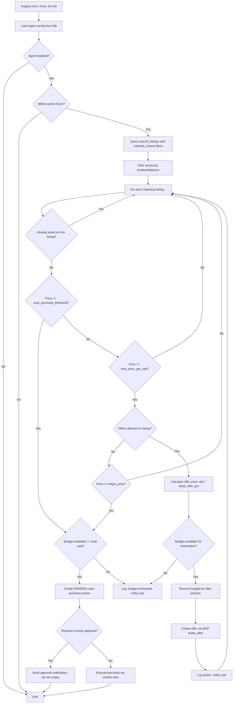
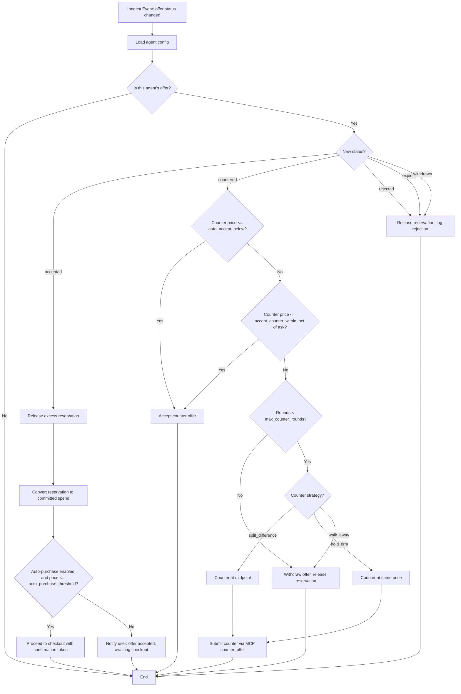
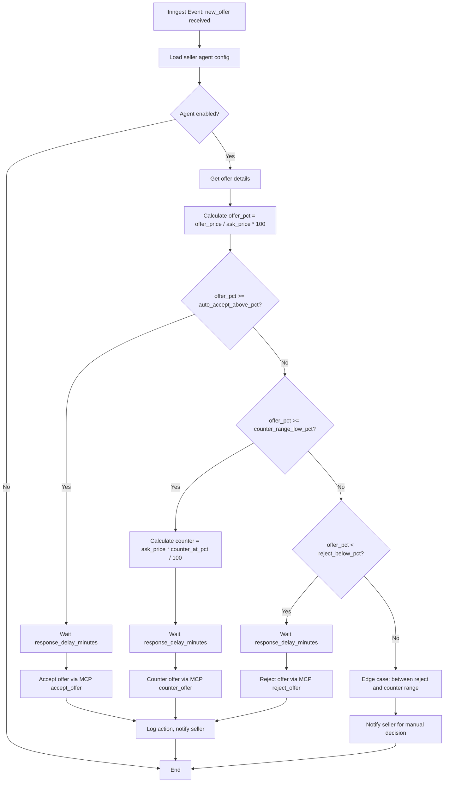
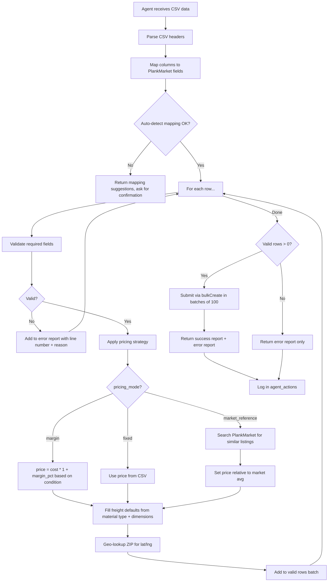
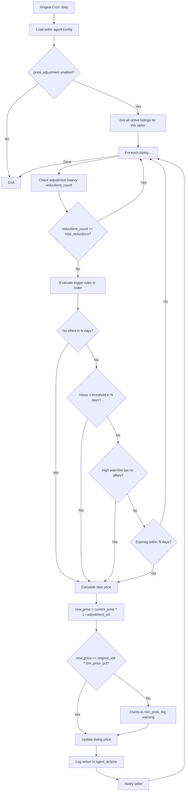
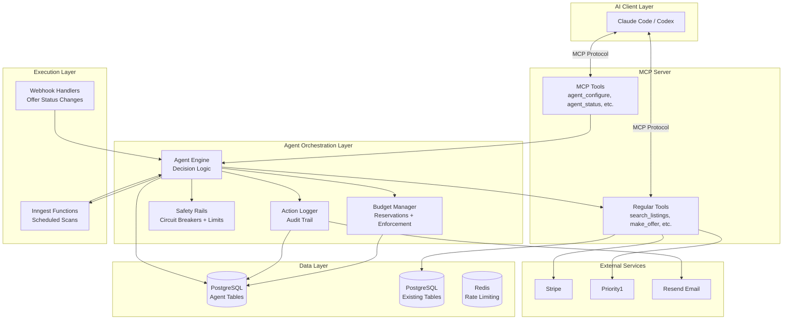
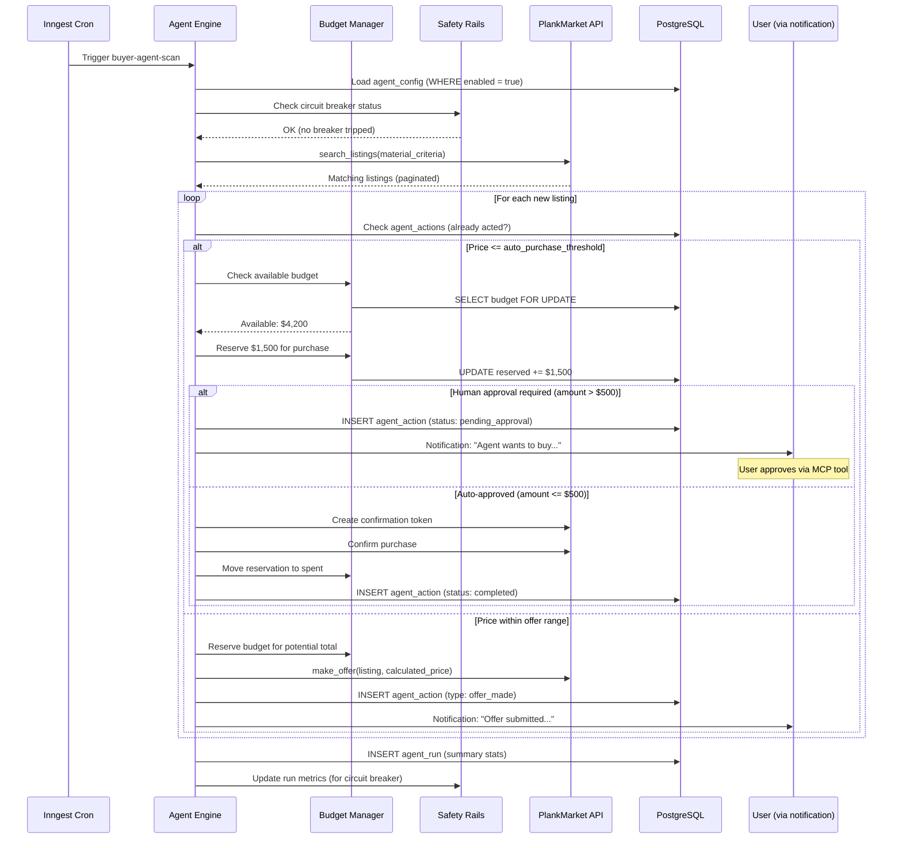
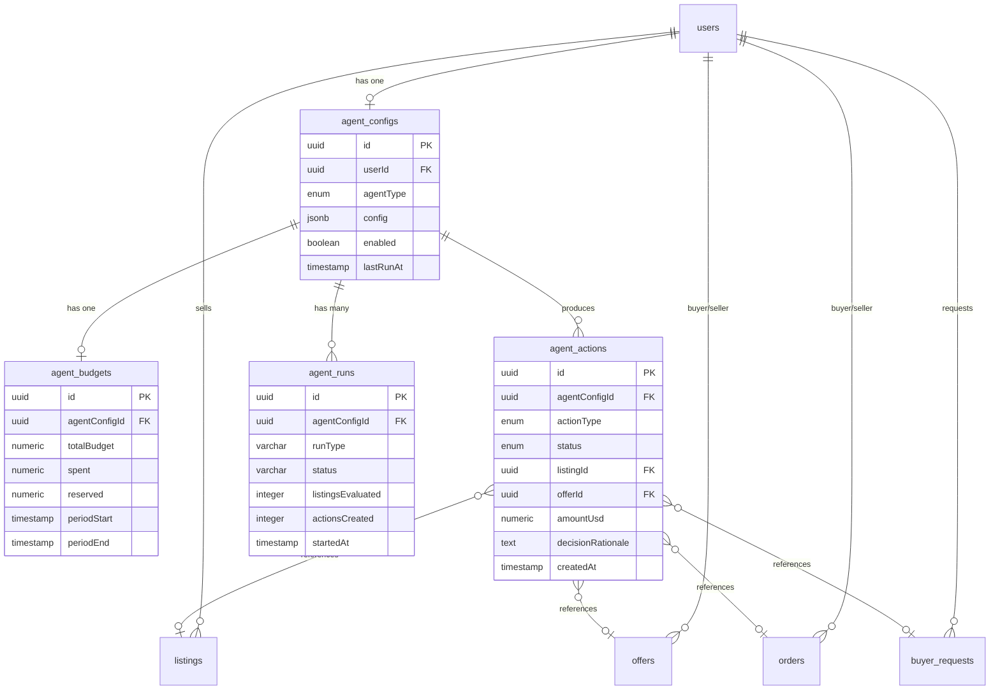
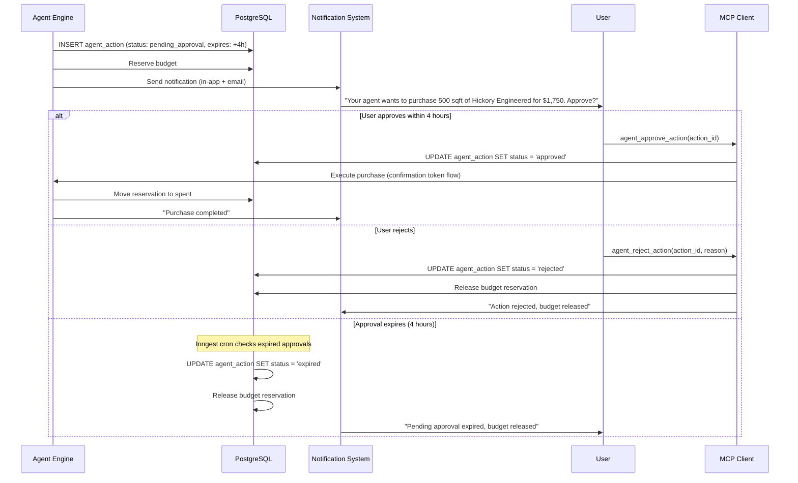
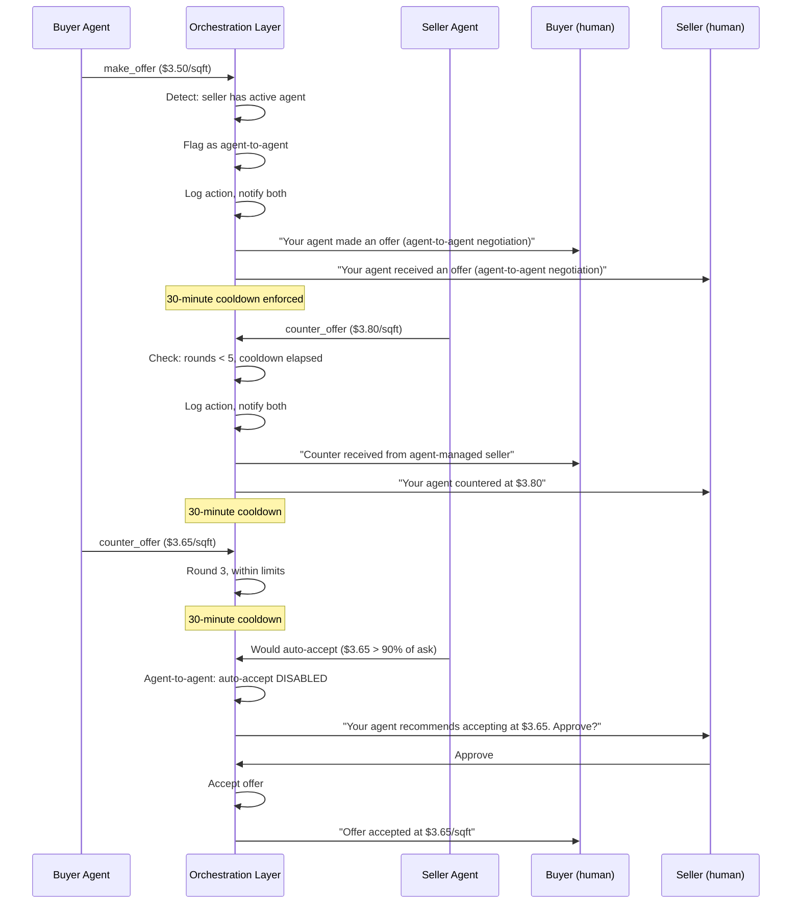

# PlankMarket Autonomous AI Agent Workflows -- Architecture Design

**Date:** March 9, 2026
**Status:** Proposed
**Author:** Architect Agent

---

## Table of Contents

1. [Executive Summary](#1-executive-summary)
2. [Architecture Decision Records](#2-architecture-decision-records)
3. [Workflow 1: Buyer Procurement Agent](#3-workflow-1-buyer-procurement-agent)
4. [Workflow 2: Seller Listing & Negotiation Agent](#4-workflow-2-seller-listing--negotiation-agent)
5. [New Infrastructure: Agent Orchestration Layer](#5-new-infrastructure-agent-orchestration-layer)
6. [Data Model Specifications](#6-data-model-specifications)
7. [API Specifications](#7-api-specifications)
8. [Safety Rails & Human Checkpoints](#8-safety-rails--human-checkpoints)
9. [Agent-to-Agent Negotiation](#9-agent-to-agent-negotiation)
10. [Notification & Reporting](#10-notification--reporting)
11. [Security Review Notes](#11-security-review-notes)
12. [Handoffs](#12-handoffs)
13. [Open Questions & Follow-Up](#13-open-questions--follow-up)

---

## 1. Executive Summary

This document designs two autonomous AI agent workflows for PlankMarket's MCP server: a **Buyer Procurement Agent** that continuously monitors the marketplace and executes purchases within configured parameters, and a **Seller Listing & Negotiation Agent** that bulk-creates inventory listings and autonomously handles incoming offers.

Both agents operate on a **poll-evaluate-act-report** loop, backed by a new **Agent Orchestration Layer** that provides configuration storage, budget tracking, state management, and safety enforcement. The design prioritizes safety rails: hard spending limits, mandatory human approval gates for high-value transactions, circuit breakers for runaway behavior, and explicit handling of edge cases like agent-to-agent negotiation and mid-negotiation budget exhaustion.

**Key architectural decisions:**
- Agent state lives in PostgreSQL (new tables), not Redis -- durability matters more than speed for financial state
- Budget enforcement happens at the orchestration layer, not in the MCP tools -- defense in depth
- Polling uses Inngest cron functions, not client-side loops -- agents run server-side for reliability
- Human approval uses a confirmation token pattern (already planned in the MCP feasibility report)
- Agent-to-agent negotiation is allowed but capped at 5 counter rounds with mandatory cooldown

---

## 2. Architecture Decision Records

### ADR-1: Agent State Storage

#### Status: proposed

#### Context
AI agents need persistent state: budget spent, offers in flight, listings created, negotiation history, and performance metrics. This state must survive agent restarts, be queryable for reporting, and be consistent under concurrent access (e.g., two offers accepted simultaneously must not exceed budget).

#### Options Considered
1. **PostgreSQL (new tables alongside existing schema)** -- Pros: ACID transactions for budget enforcement, joins with existing orders/offers/listings tables, existing Drizzle ORM infrastructure, auditable. Cons: Slightly higher latency than Redis for simple reads, adds tables to an already 18-table schema.
2. **Upstash Redis (JSON documents)** -- Pros: Fast reads, existing infrastructure, good for ephemeral state. Cons: No ACID transactions (budget race conditions), no joins with orders/offers, data loss risk on eviction, poor auditability.
3. **Hybrid: PostgreSQL for durable state + Redis for hot counters** -- Pros: Best of both worlds. Cons: Consistency gap between Redis counter and PG truth (double-spend window), operational complexity of two sources of truth.

#### Decision
PostgreSQL (Option 1).

#### Rationale
Budget enforcement is a financial operation that requires ACID guarantees. A Redis counter that says "$2,000 remaining" while PostgreSQL shows "$1,500 remaining" due to a pending commit is a double-spend bug. The latency difference (5ms vs 1ms for a read) is irrelevant for agents that poll on minute-scale intervals. PlankMarket already has row-level locking patterns (used in order creation) that apply directly.

#### Consequences
- 4 new tables added to the schema (agent_configs, agent_budgets, agent_actions, agent_runs)
- Budget checks use `SELECT ... FOR UPDATE` to prevent race conditions
- Agent state is fully queryable for dashboards and reporting
- No additional infrastructure (Redis is already at capacity for rate limiting)

---

### ADR-2: Agent Execution Model

#### Status: proposed

#### Context
Agents need to run continuously: polling for new listings, checking offer status, adjusting prices. The execution model determines reliability, cost, and user experience.

#### Options Considered
1. **Client-side loop (AI agent polls MCP tools on its own schedule)** -- Pros: Simple, no server infrastructure, agent framework handles scheduling. Cons: Requires agent to be always running (laptop open, Claude Code session active), unreliable, no guaranteed execution, context window fills up over time.
2. **Server-side Inngest cron functions** -- Pros: Reliable scheduled execution, existing infrastructure, built-in retry/error handling, runs regardless of client state, event-driven triggers possible. Cons: Adds Inngest functions, agent can't make real-time decisions (batched on cron schedule), configuration must be stored server-side.
3. **Hybrid: Inngest for scheduled polls + MCP tools for ad-hoc actions** -- Pros: Background monitoring with on-demand intervention, best reliability for autonomous operations while keeping interactive capability. Cons: Two execution paths to maintain, complexity.

#### Decision
Hybrid (Option 3).

#### Rationale
The buyer agent needs reliable background monitoring (polling every 15 minutes for new listings) that must run without the user's AI client being active. Inngest already handles this pattern for saved-search-alerts and shipment-tracking. However, users also need to interact with their agent ad-hoc via MCP tools ("show me what my agent found today", "pause my agent", "change my max price to $4.00"). The hybrid model supports both use cases.

#### Consequences
- New Inngest functions: `buyer-agent-scan`, `seller-agent-monitor`, `agent-price-adjustment`
- MCP tools for agent configuration and status queries (read/write)
- Agent configuration stored in PostgreSQL (accessed by both Inngest and MCP)
- Users can override agent decisions via MCP tools between cron runs

---

### ADR-3: Budget Enforcement Architecture

#### Status: proposed

#### Context
The buyer agent has a monthly budget (e.g., $10,000/month). Budget enforcement must prevent overspending even under concurrent operations (two offers accepted in the same second). The system must handle: committed spend (accepted offers awaiting checkout), pending spend (offers in flight that might be accepted), and completed spend (paid orders).

#### Options Considered
1. **Optimistic locking with budget check at action time** -- Pros: Simple, low contention. Cons: Race condition window between check and commit, possible overspend if two acceptances interleave.
2. **Pessimistic locking with SELECT FOR UPDATE on budget row** -- Pros: No race conditions, guaranteed consistency. Cons: Serializes all budget operations for a single agent, potential bottleneck under high concurrency.
3. **Reserved-amount pattern (pre-allocate budget for pending offers)** -- Pros: Accounts for in-flight offers, prevents overcommit, allows parallel offers. Cons: More complex, requires reservation cleanup on offer expiry/rejection, budget appears smaller than actual.

#### Decision
Reserved-amount pattern (Option 3) with pessimistic locking on the reservation operation.

#### Rationale
A buyer agent might have 5 offers in flight simultaneously. If each is for $2,000 and the budget is $10,000, all 5 could be accepted -- but the agent has only $10,000. The reserved-amount pattern holds $2,000 per active offer, so the agent knows it has $0 available and stops making new offers. When an offer is rejected/expired, the reservation releases. This is the standard pattern used in payment systems (Stripe's PaymentIntent hold is exactly this).

Pessimistic locking on the reservation row prevents two concurrent offer-creations from both reading "budget available: $4,000" and each reserving $3,000.

#### Consequences
- `agent_budgets` table tracks: `total_budget`, `spent` (completed), `reserved` (in-flight), `available` (computed: total - spent - reserved)
- Every offer creation reserves budget; every offer resolution (accept/reject/expire/withdraw) adjusts the reservation
- Inngest offer-status-change handler updates budget reservations
- Budget resets on configurable cycle (monthly by default)

---

### ADR-4: Seller Agent CSV Parsing Strategy

#### Status: proposed

#### Context
The seller agent receives a CSV/spreadsheet of inventory that must be parsed into PlankMarket listings. CSVs may have: missing required fields, invalid enum values, ambiguous column names, inconsistent units (cm vs inches), and pricing that needs strategy application.

#### Options Considered
1. **Strict validation: reject entire CSV on first error** -- Pros: Simple, no partial state. Cons: Terrible UX for a 100-row CSV with one typo.
2. **Row-by-row validation with error report** -- Pros: Processes valid rows, reports invalid ones with line numbers and reasons, user fixes and re-submits failures. Cons: Partial state (some listings created, some not), user must track what was imported.
3. **Two-pass: validate all rows first, then create all or none** -- Pros: All-or-nothing consistency, full error report before any creation. Cons: Slower (two passes), large CSV may hit transaction timeout.

#### Decision
Row-by-row validation with error report (Option 2), using PlankMarket's existing `bulkCreate` procedure which already processes up to 100 rows.

#### Rationale
The existing `bulkCreate` tRPC procedure already implements row-by-row processing within a transaction. The agent adds a validation pre-pass that maps CSV columns to PlankMarket fields, applies the seller's pricing strategy, fills in freight defaults, and produces a validation report. Valid rows are submitted; invalid rows are returned with specific error messages. This matches user expectations: "import what you can, tell me what failed."

#### Consequences
- MCP tool `agent_import_csv` wraps validation + `bulkCreate`
- Agent must handle column name mapping (fuzzy matching: "Material" -> "materialType", "Sq Ft" -> "totalSqFt")
- Pricing strategy applied as a transformation step before submission
- Import results stored in `agent_actions` for audit trail
- Maximum 100 rows per batch (existing limit); agent chunks larger CSVs

---

## 3. Workflow 1: Buyer Procurement Agent

### 3.1 Agent Configuration Schema

```yaml
# Buyer Procurement Agent Configuration
agent_type: buyer_procurement
version: 1

# === Material Specifications ===
material_criteria:
  material_types:           # required, at least one
    - engineered
    - hardwood
  species:                  # optional, filters by species
    - hickory
    - oak
  grades:                   # optional
    - select
    - premium
    - 1_common
  conditions:               # optional, defaults to all
    - new_overstock
    - closeout
  min_lot_sqft: 500         # minimum lot size
  max_lot_sqft: null        # null = no maximum
  certifications:           # optional
    - floorscore
    - carb2
  min_thickness: null       # inches, optional
  min_wear_layer: null      # mil for vinyl, mm for engineered, optional

# === Budget ===
budget:
  monthly_limit: 10000.00   # USD, hard cap
  cycle_day: 1              # day of month budget resets
  auto_purchase_threshold: 3.00  # buy immediately if price/sqft <= this
  offer_reserve_pct: 100    # % of potential total to reserve from budget

# === Pricing Rules ===
pricing:
  max_price_per_sqft: 4.50  # absolute ceiling, never exceed
  target_price_per_sqft: 3.50  # preferred price, try to achieve via negotiation
  initial_offer_pct: 85     # first offer = X% of ask price
  accept_counter_within_pct: 95  # accept counter if <= X% of ask
  walk_away_above: 4.50     # reject/withdraw if counter exceeds this

# === Location / Shipping ===
location:
  destination_zip: "80202"  # Denver, CO
  max_distance_miles: 300   # null = no distance filter
  shipping_ok: true
  pickup_ok: false

# === Quantity Targets ===
quantity:
  monthly_target_sqft: 2000 # advisory, not enforced as hard limit
  min_per_purchase_sqft: 200  # don't bother with tiny lots

# === Quality Preferences ===
quality:
  prefer_verified_sellers: true   # sort verified sellers first
  min_seller_rating: 4.0          # skip sellers below this (null = no filter)
  prefer_ship_ready: true         # prefer listings marked ship-ready

# === Negotiation Rules ===
negotiation:
  max_counter_rounds: 3           # give up after N rounds
  counter_strategy: split_difference  # split_difference | hold_firm | walk_away
  # split_difference: counter at midpoint between last offer and ask
  # hold_firm: repeat same offer
  # walk_away: reject if counter > accept threshold
  auto_accept_below: 3.00         # auto-accept any counter below this price
  message_template: "Interested in this material for a commercial project. Looking for competitive pricing on bulk quantities."

# === Scanning Schedule ===
schedule:
  scan_interval_minutes: 15       # how often to poll for new listings
  active_hours:                   # optional, only scan during these hours (UTC)
    start: "14:00"                # 8 AM Mountain
    end: "02:00"                  # 8 PM Mountain
  enabled: true                   # master on/off switch

# === Notifications ===
notifications:
  channels:
    - in_app
    - email
  notify_on:
    - offer_made
    - offer_accepted
    - offer_rejected
    - auto_purchase
    - budget_75pct          # alert at 75% budget consumed
    - budget_exhausted
    - scan_error
  daily_summary: true
```

### 3.2 Decision Engine Flow



### 3.3 Offer Negotiation Handling



### 3.4 MCP Tools Required

| Tool | Exists? | Used For |
|------|---------|----------|
| `search_listings` | Yes (Phase 1) | Polling for matching listings |
| `get_listing_details` | Yes (Phase 1) | Deep-dive on candidates |
| `get_search_facets` | Yes (Phase 1) | Understanding market availability |
| `make_offer` | Yes (Phase 3) | Submitting offers |
| `get_my_offers` | Yes (Phase 1) | Checking offer status |
| `get_offer_by_id` | Yes (Phase 1) | Detailed offer tracking |
| `get_shipping_quote` | Yes (Phase 1) | Estimating total cost with shipping |
| `add_to_watchlist` | Yes (Phase 1) | Tracking interesting listings |
| `save_search` | Yes (Phase 1) | Setting up persistent monitors |
| **`agent_configure`** | **New** | Set/update agent configuration |
| **`agent_status`** | **New** | Get current agent state (budget, actions, active offers) |
| **`agent_pause`** / **`agent_resume`** | **New** | Toggle agent on/off |
| **`agent_approve_action`** | **New** | Human approves a pending action |
| **`agent_reject_action`** | **New** | Human rejects a pending action |
| **`agent_budget_status`** | **New** | Detailed budget breakdown |
| **`agent_action_log`** | **New** | Paginated history of agent actions |

---

## 4. Workflow 2: Seller Listing & Negotiation Agent

### 4.1 Agent Configuration Schema

```yaml
# Seller Listing & Negotiation Agent Configuration
agent_type: seller_management
version: 1

# === Pricing Strategy ===
pricing_strategy:
  default_margin: 10       # % above cost/wholesale for standard items
  premium_margin: 15       # % above cost for premium condition
  clearance_discount: 15   # % below cost for clearance/remnants
  pricing_mode: margin     # margin | fixed | market_reference
  # margin: apply margin to cost column in CSV
  # fixed: use price column from CSV directly
  # market_reference: search PlankMarket for similar, price relative to market

# === Negotiation Rules ===
negotiation:
  auto_accept_above_pct: 90      # accept offers >= X% of ask
  counter_range_low_pct: 80      # counter at 95% if offer is 80-90% of ask
  counter_range_high_pct: 90
  counter_at_pct: 95             # counter price = X% of ask
  reject_below_pct: 80           # reject offers below X% of ask
  max_counter_rounds: 3
  response_delay_minutes: 30     # wait before responding (appear human)
  message_templates:
    accept: "Thank you for your offer. We're happy to proceed at this price."
    counter: "We appreciate your interest. We can offer a better price of ${counter_price}/sqft for this material."
    reject: "Thank you for your offer, but we're unable to accept at that price point."

# === Auto-Relist / Price Adjustment Rules ===
price_adjustment:
  enabled: true
  check_interval_days: 7         # evaluate listings every N days
  rules:
    - trigger: no_offers
      days: 14                   # if no offers in 14 days
      action: reduce_price
      amount_pct: 5              # drop price 5%
    - trigger: no_views
      days: 7                    # if < 10 views in 7 days
      threshold: 10
      action: reduce_price
      amount_pct: 3
    - trigger: high_watchlist
      threshold: 10              # if >= 10 watchlist adds but no offers
      action: reduce_price
      amount_pct: 2              # small nudge
    - trigger: listing_expiring
      days_before_expiry: 14
      action: reduce_price
      amount_pct: 10
  min_price_pct: 70              # never drop below 70% of original ask
  max_reductions: 3              # max number of price drops per listing

# === RFQ (Buyer Request) Monitoring ===
rfq_monitoring:
  enabled: true
  auto_respond: true
  match_criteria:                # only respond to requests matching these
    material_types: []           # empty = match against seller's inventory
    min_sqft: 100
  response_template: "We have inventory that matches your request. Please see listing ${listing_url} for details. We can offer competitive pricing for bulk orders."

# === Listing Defaults ===
listing_defaults:
  status: active                 # active | draft (draft requires manual review)
  allow_offers: true
  expiry_days: 90
  ship_ready: false

# === CSV Column Mapping ===
csv_mapping:
  auto_detect: true              # attempt fuzzy matching of column names
  overrides:                     # explicit mappings if auto-detect fails
    # csv_column_name: plankmarket_field
    "Material": materialType
    "Type": materialType
    "Sq Ft": totalSqFt
    "Price": askPricePerSqFt
    "ZIP": locationZip

# === Promotion Budget ===
promotions:
  monthly_budget: 200.00
  auto_promote: true
  strategy: worst_performing     # worst_performing | newest | highest_value
  # worst_performing: promote listings with most days and fewest views
  # newest: promote newly created listings
  # highest_value: promote highest total lot value listings
  preferred_tier: featured       # spotlight | featured | premium

# === Scanning Schedule ===
schedule:
  offer_check_interval_minutes: 15
  rfq_check_interval_minutes: 60
  price_adjustment_cron: "0 6 * * *"  # daily at 6 AM UTC
  enabled: true

# === Notifications ===
notifications:
  channels:
    - in_app
    - email
  notify_on:
    - offer_received
    - offer_auto_accepted
    - offer_auto_countered
    - offer_auto_rejected
    - price_adjusted
    - listing_created
    - listing_import_errors
    - rfq_response_sent
    - promotion_purchased
    - budget_75pct
  daily_summary: true
```

### 4.2 Decision Engine: Offer Response



### 4.3 Decision Engine: CSV Import



### 4.4 Decision Engine: Price Adjustment



### 4.5 MCP Tools Required

| Tool | Exists? | Used For |
|------|---------|----------|
| `create_listing` | Yes (Phase 2) | Creating individual listings |
| `bulk_create_listings` | Yes (Phase 3) | CSV import |
| `update_listing` | Yes (Phase 2) | Price adjustments |
| `get_my_listings` | Yes (Phase 1) | Monitoring own inventory |
| `get_listing_analytics` | Yes (Phase 1) | Engagement data for price adjustment decisions |
| `accept_offer` | Yes (Phase 3) | Auto-accepting offers |
| `counter_offer` | Yes (Phase 2) | Auto-countering offers |
| `reject_offer` | Yes (Phase 2) | Auto-rejecting offers |
| `get_by_listing` (offers) | Yes (Phase 1) | Checking incoming offers |
| `find_matching_requests` | Yes (Phase 1) | Finding matching buyer RFQs |
| `respond_to_buyer_request` | Yes (Phase 2) | Auto-responding to RFQs |
| `purchase_promotion` | Yes (Phase 3) | Auto-promoting listings |
| `get_sales_stats` | Yes (Phase 1) | Performance monitoring |
| **`agent_configure`** | **New** | Set/update agent configuration |
| **`agent_status`** | **New** | Get current agent state |
| **`agent_import_csv`** | **New** | Parse + validate + import CSV |
| **`agent_import_status`** | **New** | Check import results |
| **`agent_price_history`** | **New** | View price adjustment history per listing |
| **`agent_pause`** / **`agent_resume`** | **New** | Toggle agent on/off |
| **`agent_approve_action`** | **New** | Human approves a pending action |

---

## 5. New Infrastructure: Agent Orchestration Layer

### 5.1 System Architecture



### 5.2 Agent Run Loop (Buyer)



### 5.3 Component Responsibilities

| Component | Responsibility |
|-----------|---------------|
| **Agent Engine** | Core decision logic. Loads config, evaluates listings/offers against rules, determines actions. Pure function: (config, market_state, budget_state) -> actions. |
| **Budget Manager** | ACID-safe budget operations. Reserves, commits, releases budget. Monthly reset. Reports available/reserved/spent. |
| **Safety Rails** | Circuit breakers (pause agent if error rate > 50% in last hour), spending velocity limits ($X per hour), human approval gates, agent-to-agent detection. |
| **Action Logger** | Immutable audit trail. Every agent decision logged with: timestamp, action type, listing/offer ID, decision rationale, config snapshot at decision time. |
| **Inngest Functions** | Scheduled execution. buyer-agent-scan (every 15 min), seller-agent-monitor (every 15 min), agent-price-adjustment (daily). |

---

## 6. Data Model Specifications

### 6.1 New Tables

| Entity | Field | Type | Constraints | Notes |
|--------|-------|------|-------------|-------|
| **agent_configs** | id | UUID | PK, defaultRandom() | |
| | userId | UUID | FK -> users.id, NOT NULL, UNIQUE | One agent config per user |
| | agentType | pgEnum('agent_type') | NOT NULL | 'buyer_procurement' or 'seller_management' |
| | config | JSONB | NOT NULL | Full YAML config serialized as JSON |
| | configVersion | INTEGER | NOT NULL, DEFAULT 1 | Schema version for migrations |
| | enabled | BOOLEAN | NOT NULL, DEFAULT false | Master on/off |
| | pausedAt | TIMESTAMP(tz) | NULLABLE | When manually paused |
| | pauseReason | TEXT | NULLABLE | Why paused (user or system) |
| | lastRunAt | TIMESTAMP(tz) | NULLABLE | Last successful scan |
| | lastErrorAt | TIMESTAMP(tz) | NULLABLE | Last error |
| | lastError | TEXT | NULLABLE | Last error message |
| | errorCount | INTEGER | NOT NULL, DEFAULT 0 | Consecutive errors (reset on success) |
| | createdAt | TIMESTAMP(tz) | NOT NULL, DEFAULT now() | |
| | updatedAt | TIMESTAMP(tz) | NOT NULL, DEFAULT now() | |

| Entity | Field | Type | Constraints | Notes |
|--------|-------|------|-------------|-------|
| **agent_budgets** | id | UUID | PK, defaultRandom() | |
| | agentConfigId | UUID | FK -> agent_configs.id, NOT NULL, UNIQUE | One budget per agent |
| | userId | UUID | FK -> users.id, NOT NULL | Denormalized for fast queries |
| | periodStart | TIMESTAMP(tz) | NOT NULL | Start of current budget period |
| | periodEnd | TIMESTAMP(tz) | NOT NULL | End of current budget period |
| | totalBudget | NUMERIC (money) | NOT NULL | Total budget for this period |
| | spent | NUMERIC (money) | NOT NULL, DEFAULT 0 | Completed purchases |
| | reserved | NUMERIC (money) | NOT NULL, DEFAULT 0 | In-flight offers/pending approvals |
| | promotionSpent | NUMERIC (money) | NOT NULL, DEFAULT 0 | Seller: promotion spending |
| | promotionBudget | NUMERIC (money) | NULLABLE | Seller: promotion budget cap |
| | createdAt | TIMESTAMP(tz) | NOT NULL, DEFAULT now() | |
| | updatedAt | TIMESTAMP(tz) | NOT NULL, DEFAULT now() | |

| Entity | Field | Type | Constraints | Notes |
|--------|-------|------|-------------|-------|
| **agent_actions** | id | UUID | PK, defaultRandom() | |
| | agentConfigId | UUID | FK -> agent_configs.id, NOT NULL | |
| | userId | UUID | FK -> users.id, NOT NULL | Denormalized |
| | actionType | pgEnum('agent_action_type') | NOT NULL | See enum below |
| | status | pgEnum('agent_action_status') | NOT NULL, DEFAULT 'completed' | pending_approval, approved, rejected, completed, failed, expired |
| | listingId | UUID | FK -> listings.id, NULLABLE | Related listing |
| | offerId | UUID | FK -> offers.id, NULLABLE | Related offer |
| | orderId | UUID | FK -> orders.id, NULLABLE | Related order |
| | buyerRequestId | UUID | FK -> buyer_requests.id, NULLABLE | Related RFQ |
| | amountUsd | NUMERIC (money) | NULLABLE | Financial amount |
| | reservationId | UUID | NULLABLE | Links to budget reservation |
| | decisionRationale | TEXT | NOT NULL | Why the agent made this decision |
| | configSnapshot | JSONB | NULLABLE | Relevant config values at decision time |
| | inputData | JSONB | NULLABLE | Data the agent evaluated (listing summary, offer details) |
| | resultData | JSONB | NULLABLE | Outcome (created offer ID, error message, etc.) |
| | approvalExpiresAt | TIMESTAMP(tz) | NULLABLE | Deadline for human approval |
| | approvedBy | UUID | FK -> users.id, NULLABLE | **PII: links to approving user** |
| | createdAt | TIMESTAMP(tz) | NOT NULL, DEFAULT now() | |
| | updatedAt | TIMESTAMP(tz) | NOT NULL, DEFAULT now() | |

| Entity | Field | Type | Constraints | Notes |
|--------|-------|------|-------------|-------|
| **agent_runs** | id | UUID | PK, defaultRandom() | |
| | agentConfigId | UUID | FK -> agent_configs.id, NOT NULL | |
| | userId | UUID | FK -> users.id, NOT NULL | Denormalized |
| | runType | VARCHAR(50) | NOT NULL | 'buyer_scan', 'seller_offer_check', 'price_adjustment', 'rfq_scan' |
| | status | VARCHAR(20) | NOT NULL | 'running', 'completed', 'failed', 'circuit_broken' |
| | startedAt | TIMESTAMP(tz) | NOT NULL, DEFAULT now() | |
| | completedAt | TIMESTAMP(tz) | NULLABLE | |
| | listingsEvaluated | INTEGER | DEFAULT 0 | |
| | actionsCreated | INTEGER | DEFAULT 0 | |
| | offersInFlight | INTEGER | DEFAULT 0 | Snapshot at run time |
| | budgetAvailable | NUMERIC (money) | NULLABLE | Snapshot at run time |
| | errorMessage | TEXT | NULLABLE | If failed |
| | metadata | JSONB | NULLABLE | Additional run stats |

### 6.2 Enums

```sql
CREATE TYPE agent_type AS ENUM ('buyer_procurement', 'seller_management');

CREATE TYPE agent_action_type AS ENUM (
  -- Buyer actions
  'offer_made',
  'offer_countered',
  'offer_accepted',
  'offer_withdrawn',
  'auto_purchase',
  'listing_watchlisted',
  -- Seller actions
  'listing_created',
  'listing_bulk_imported',
  'listing_price_adjusted',
  'offer_auto_accepted',
  'offer_auto_countered',
  'offer_auto_rejected',
  'rfq_auto_responded',
  'promotion_purchased',
  -- Common
  'budget_reserved',
  'budget_released',
  'budget_committed',
  'agent_paused',
  'agent_resumed',
  'config_updated'
);

CREATE TYPE agent_action_status AS ENUM (
  'pending_approval',
  'approved',
  'rejected',
  'completed',
  'failed',
  'expired'
);
```

### 6.3 Indexes

```sql
-- agent_configs
CREATE INDEX agent_configs_user_id_idx ON agent_configs(user_id);
CREATE INDEX agent_configs_enabled_idx ON agent_configs(enabled);
CREATE INDEX agent_configs_agent_type_idx ON agent_configs(agent_type);

-- agent_budgets
CREATE INDEX agent_budgets_agent_config_id_idx ON agent_budgets(agent_config_id);
CREATE INDEX agent_budgets_user_id_idx ON agent_budgets(user_id);
CREATE INDEX agent_budgets_period_end_idx ON agent_budgets(period_end);

-- agent_actions
CREATE INDEX agent_actions_agent_config_id_idx ON agent_actions(agent_config_id);
CREATE INDEX agent_actions_user_id_idx ON agent_actions(user_id);
CREATE INDEX agent_actions_action_type_idx ON agent_actions(action_type);
CREATE INDEX agent_actions_status_idx ON agent_actions(status);
CREATE INDEX agent_actions_listing_id_idx ON agent_actions(listing_id);
CREATE INDEX agent_actions_offer_id_idx ON agent_actions(offer_id);
CREATE INDEX agent_actions_created_at_idx ON agent_actions(created_at);
CREATE INDEX agent_actions_pending_approval_idx ON agent_actions(status, approval_expires_at)
  WHERE status = 'pending_approval';

-- agent_runs
CREATE INDEX agent_runs_agent_config_id_idx ON agent_runs(agent_config_id);
CREATE INDEX agent_runs_started_at_idx ON agent_runs(started_at);
CREATE INDEX agent_runs_status_idx ON agent_runs(status);
```

### 6.4 Entity Relationship Diagram



---

## 7. API Specifications

### 7.1 Agent MCP Tools (OpenAPI 3.x)

```yaml
openapi: 3.0.3
info:
  title: PlankMarket Agent Orchestration API
  description: |
    MCP tool definitions for AI agent configuration, budget management,
    and action oversight. These tools are exposed via the PlankMarket
    MCP server and called by AI agents (Claude Code, Codex, etc.).
  version: 1.0.0

paths:
  /tools/agent_configure:
    post:
      operationId: agent_configure
      summary: Create or update an agent configuration
      description: |
        Sets up or modifies the autonomous agent for the authenticated user.
        Only one agent config per user. Validates the config against the
        agent_type schema before saving. Enabling an agent requires a valid
        budget to be configured.
      security:
        - mcpOAuth: [agent:write]
      requestBody:
        required: true
        content:
          application/json:
            schema:
              type: object
              required:
                - agent_type
                - config
              properties:
                agent_type:
                  type: string
                  enum: [buyer_procurement, seller_management]
                config:
                  type: object
                  description: Full agent configuration (see YAML schemas above)
                enabled:
                  type: boolean
                  default: false
      responses:
        '200':
          description: Agent configured successfully
          content:
            application/json:
              schema:
                $ref: '#/components/schemas/AgentConfig'
        '400':
          description: Invalid configuration
          content:
            application/json:
              schema:
                $ref: '#/components/schemas/ValidationError'
        '401':
          $ref: '#/components/responses/Unauthorized'
        '409':
          description: User already has an agent of different type
          content:
            application/json:
              schema:
                $ref: '#/components/schemas/Error'

  /tools/agent_status:
    post:
      operationId: agent_status
      summary: Get current agent state
      description: |
        Returns the agent's configuration, budget status, active offers,
        recent actions, and next scheduled run time. Provides a complete
        snapshot of the agent's current state.
      security:
        - mcpOAuth: [agent:read]
      requestBody:
        required: false
        content:
          application/json:
            schema:
              type: object
              properties:
                include_recent_actions:
                  type: boolean
                  default: true
                actions_limit:
                  type: integer
                  default: 10
                  maximum: 50
      responses:
        '200':
          description: Agent status
          content:
            application/json:
              schema:
                $ref: '#/components/schemas/AgentStatus'
        '401':
          $ref: '#/components/responses/Unauthorized'
        '404':
          description: No agent configured for this user

  /tools/agent_pause:
    post:
      operationId: agent_pause
      summary: Pause the agent
      description: |
        Immediately pauses the agent. Active negotiations are NOT withdrawn --
        they continue to expiry. No new actions will be initiated until resumed.
        Existing pending_approval actions remain pending.
      security:
        - mcpOAuth: [agent:write]
      requestBody:
        required: false
        content:
          application/json:
            schema:
              type: object
              properties:
                reason:
                  type: string
                  maxLength: 500
      responses:
        '200':
          description: Agent paused
          content:
            application/json:
              schema:
                type: object
                properties:
                  paused: { type: boolean, example: true }
                  active_offers: { type: integer, example: 3 }
                  message: { type: string }
        '401':
          $ref: '#/components/responses/Unauthorized'
        '404':
          description: No agent configured

  /tools/agent_resume:
    post:
      operationId: agent_resume
      summary: Resume a paused agent
      security:
        - mcpOAuth: [agent:write]
      responses:
        '200':
          description: Agent resumed
          content:
            application/json:
              schema:
                type: object
                properties:
                  enabled: { type: boolean, example: true }
                  next_run_at: { type: string, format: date-time }
        '401':
          $ref: '#/components/responses/Unauthorized'
        '400':
          description: Cannot resume -- budget exhausted or config invalid

  /tools/agent_budget_status:
    post:
      operationId: agent_budget_status
      summary: Get detailed budget breakdown
      security:
        - mcpOAuth: [agent:read]
      responses:
        '200':
          description: Budget details
          content:
            application/json:
              schema:
                $ref: '#/components/schemas/BudgetStatus'
        '401':
          $ref: '#/components/responses/Unauthorized'
        '404':
          description: No budget configured

  /tools/agent_approve_action:
    post:
      operationId: agent_approve_action
      summary: Approve a pending agent action
      description: |
        Human approves a pending action (e.g., a purchase exceeding the
        auto-approve threshold). The action must be in pending_approval
        status and not expired.
      security:
        - mcpOAuth: [agent:write, transactions:write]
      requestBody:
        required: true
        content:
          application/json:
            schema:
              type: object
              required:
                - action_id
              properties:
                action_id:
                  type: string
                  format: uuid
      responses:
        '200':
          description: Action approved and executed
          content:
            application/json:
              schema:
                $ref: '#/components/schemas/AgentAction'
        '400':
          description: Action expired or already processed
        '401':
          $ref: '#/components/responses/Unauthorized'
        '404':
          description: Action not found

  /tools/agent_reject_action:
    post:
      operationId: agent_reject_action
      summary: Reject a pending agent action
      description: |
        Human rejects a pending action. Budget reservation is released.
        The agent will not retry this specific action but may find
        alternative listings.
      security:
        - mcpOAuth: [agent:write]
      requestBody:
        required: true
        content:
          application/json:
            schema:
              type: object
              required:
                - action_id
              properties:
                action_id:
                  type: string
                  format: uuid
                reason:
                  type: string
                  maxLength: 500
      responses:
        '200':
          description: Action rejected, reservation released
          content:
            application/json:
              schema:
                $ref: '#/components/schemas/AgentAction'
        '401':
          $ref: '#/components/responses/Unauthorized'
        '404':
          description: Action not found

  /tools/agent_action_log:
    post:
      operationId: agent_action_log
      summary: Get paginated history of agent actions
      security:
        - mcpOAuth: [agent:read]
      requestBody:
        required: false
        content:
          application/json:
            schema:
              type: object
              properties:
                page:
                  type: integer
                  default: 1
                  minimum: 1
                limit:
                  type: integer
                  default: 20
                  minimum: 1
                  maximum: 100
                action_type:
                  type: string
                  enum: [offer_made, offer_countered, offer_accepted, auto_purchase, listing_created, listing_price_adjusted, offer_auto_accepted, offer_auto_countered, offer_auto_rejected, rfq_auto_responded]
                status:
                  type: string
                  enum: [pending_approval, approved, rejected, completed, failed, expired]
      responses:
        '200':
          description: Paginated action log
          content:
            application/json:
              schema:
                type: object
                properties:
                  items:
                    type: array
                    items:
                      $ref: '#/components/schemas/AgentAction'
                  total: { type: integer }
                  page: { type: integer }
                  limit: { type: integer }
                  totalPages: { type: integer }
        '401':
          $ref: '#/components/responses/Unauthorized'

  /tools/agent_import_csv:
    post:
      operationId: agent_import_csv
      summary: Parse, validate, and import CSV inventory as listings
      description: |
        Seller-only tool. Accepts CSV data (as text), validates each row
        against PlankMarket listing requirements, applies the seller's
        pricing strategy, fills freight defaults, and creates listings
        via bulkCreate. Returns a detailed report of successes and failures.
        Maximum 100 rows per call.
      security:
        - mcpOAuth: [agent:write, listings:write]
      requestBody:
        required: true
        content:
          application/json:
            schema:
              type: object
              required:
                - csv_data
              properties:
                csv_data:
                  type: string
                  description: Raw CSV text content
                  maxLength: 500000
                column_mapping:
                  type: object
                  description: Optional explicit column mapping overrides
                  additionalProperties:
                    type: string
                pricing_mode:
                  type: string
                  enum: [margin, fixed, market_reference]
                  description: Override pricing mode from agent config
                create_as_draft:
                  type: boolean
                  default: false
                  description: Create as drafts for review instead of active
      responses:
        '200':
          description: Import results
          content:
            application/json:
              schema:
                $ref: '#/components/schemas/ImportResult'
        '400':
          description: CSV parsing failed entirely
        '401':
          $ref: '#/components/responses/Unauthorized'

  /tools/agent_price_history:
    post:
      operationId: agent_price_history
      summary: View price adjustment history for a listing
      security:
        - mcpOAuth: [agent:read]
      requestBody:
        required: true
        content:
          application/json:
            schema:
              type: object
              required:
                - listing_id
              properties:
                listing_id:
                  type: string
                  format: uuid
      responses:
        '200':
          description: Price history
          content:
            application/json:
              schema:
                type: object
                properties:
                  listing_id: { type: string }
                  current_price: { type: number }
                  original_price: { type: number }
                  adjustments:
                    type: array
                    items:
                      type: object
                      properties:
                        date: { type: string, format: date-time }
                        old_price: { type: number }
                        new_price: { type: number }
                        trigger: { type: string }
                        rationale: { type: string }
        '401':
          $ref: '#/components/responses/Unauthorized'
        '404':
          description: Listing not found or not owned by user

components:
  securitySchemes:
    mcpOAuth:
      type: oauth2
      flows:
        authorizationCode:
          authorizationUrl: /oauth/authorize
          tokenUrl: /oauth/token
          scopes:
            agent:read: Read agent configuration and status
            agent:write: Modify agent configuration
            transactions:write: Approve financial transactions
            listings:write: Create and modify listings

  schemas:
    AgentConfig:
      type: object
      properties:
        id: { type: string, format: uuid }
        agent_type: { type: string }
        config: { type: object }
        enabled: { type: boolean }
        last_run_at: { type: string, format: date-time, nullable: true }
        error_count: { type: integer }
        created_at: { type: string, format: date-time }

    AgentStatus:
      type: object
      properties:
        config:
          $ref: '#/components/schemas/AgentConfig'
        budget:
          $ref: '#/components/schemas/BudgetStatus'
        active_offers:
          type: integer
          description: Number of in-flight offers
        pending_approvals:
          type: integer
          description: Actions awaiting human approval
        next_run_at:
          type: string
          format: date-time
          nullable: true
        recent_actions:
          type: array
          items:
            $ref: '#/components/schemas/AgentAction'
        circuit_breaker_status:
          type: string
          enum: [ok, warning, tripped]
        run_stats:
          type: object
          properties:
            total_runs: { type: integer }
            successful_runs: { type: integer }
            last_24h_actions: { type: integer }

    BudgetStatus:
      type: object
      properties:
        period_start: { type: string, format: date-time }
        period_end: { type: string, format: date-time }
        total_budget: { type: number }
        spent: { type: number }
        reserved: { type: number }
        available:
          type: number
          description: "total_budget - spent - reserved"
        utilization_pct: { type: number }
        days_remaining: { type: integer }
        daily_burn_rate: { type: number }
        projected_end_of_period_spend: { type: number }

    AgentAction:
      type: object
      properties:
        id: { type: string, format: uuid }
        action_type: { type: string }
        status: { type: string }
        listing_id: { type: string, format: uuid, nullable: true }
        offer_id: { type: string, format: uuid, nullable: true }
        amount_usd: { type: number, nullable: true }
        decision_rationale: { type: string }
        created_at: { type: string, format: date-time }
        approval_expires_at: { type: string, format: date-time, nullable: true }
        result_data: { type: object, nullable: true }

    ImportResult:
      type: object
      properties:
        total_rows: { type: integer }
        successful: { type: integer }
        failed: { type: integer }
        skipped: { type: integer }
        created_listing_ids:
          type: array
          items: { type: string, format: uuid }
        errors:
          type: array
          items:
            type: object
            properties:
              row_number: { type: integer }
              csv_row_data: { type: object }
              errors:
                type: array
                items: { type: string }
        warnings:
          type: array
          items:
            type: object
            properties:
              row_number: { type: integer }
              message: { type: string }
        pricing_applied:
          type: object
          properties:
            mode: { type: string }
            avg_price_per_sqft: { type: number }
            min_price: { type: number }
            max_price: { type: number }

    ValidationError:
      type: object
      properties:
        code: { type: string, example: "INVALID_CONFIG" }
        message: { type: string }
        field_errors:
          type: array
          items:
            type: object
            properties:
              field: { type: string }
              message: { type: string }

    Error:
      type: object
      properties:
        code: { type: string }
        message: { type: string }

  responses:
    Unauthorized:
      description: Missing or invalid authentication
      content:
        application/json:
          schema:
            $ref: '#/components/schemas/Error'
```

---

## 8. Safety Rails & Human Checkpoints

### 8.1 Safety Rail Summary

| Rail | Type | Trigger | Action |
|------|------|---------|--------|
| **Hard budget cap** | Preventive | Budget available < action cost | Block action, notify user |
| **Human approval gate** | Checkpoint | Purchase > $500 (configurable) | Pause action, await approval with 4-hour expiry |
| **Circuit breaker** | Reactive | > 3 consecutive errors OR > 50% error rate in 1 hour | Pause agent, notify user |
| **Spending velocity limit** | Preventive | > $2,000 spent in 1 hour (configurable) | Pause agent, notify user |
| **Daily action limit** | Preventive | > 50 offers or purchases in 24 hours | Pause agent, notify user |
| **Duplicate action guard** | Preventive | Agent already acted on this listing | Skip listing |
| **Self-dealing prevention** | Preventive | Agent's user owns the listing | Skip listing (exists in offer.createOffer) |
| **Min price floor** | Preventive | Seller price adjustment would go below min_price_pct | Clamp to floor |
| **Max counter rounds** | Preventive | Negotiation exceeds max_counter_rounds | Withdraw (buyer) or reject (seller) |
| **Agent-to-agent cooldown** | Rate limit | Two agents negotiating with each other | Max 5 rounds, 30-min delay between actions |
| **Listing spam prevention** | Preventive | > 100 listings created in 24 hours | Pause agent, notify user |
| **Stale config detection** | Advisory | Config not updated in 30+ days | Notify user to review |

### 8.2 Human Approval Flow



### 8.3 What Requires Human Approval (Configurable)

| Action | Default Threshold | Configurable? |
|--------|------------------|---------------|
| Auto-purchase (buyer) | Any purchase > $500 | Yes, via `budget.auto_approve_limit` |
| Accept offer (seller) | Any acceptance > $5,000 total | Yes |
| Bulk CSV import | > 20 listings in one batch | Yes |
| Price reduction (seller) | Cumulative reduction > 20% from original | Yes |
| Promotion purchase (seller) | Any promotion purchase | No -- always requires approval in v1 |

### 8.4 Edge Case: Budget Exhaustion Mid-Negotiation

```mermaid
flowchart TD
    A[Buyer agent has 3 offers in flight] --> B[Offer #1 accepted: $3,000]
    B --> C[Budget: $10,000 total, $3,000 spent, $4,000 reserved for #2 and #3]
    C --> D[Available: $3,000]
    D --> E[Offer #2 accepted: $4,000]
    E --> F{Reserved $4,000 covers it}
    F -- Yes --> G[Move $4,000 from reserved to spent]
    G --> H[Budget: $7,000 spent, $0 reserved for #3? No...]

    Note over H: Wait -- offer #3 had $2,000 reserved
    H --> I[Budget: $7,000 spent, $2,000 reserved, $1,000 available]
    I --> J[Offer #3 gets countered at $2,500]
    J --> K{$2,500 > $2,000 reserved}
    K --> L{Additional $500 available from budget?}
    L -- Yes, $1,000 available --> M[Increase reservation to $2,500]
    L -- No --> N[Withdraw offer, release $2,000 reservation, notify user]
```

The key insight: reservations are for the **current offer amount**. When a counter comes in at a higher price, the agent checks if the difference can be covered by available budget. If not, the agent must withdraw.

---

## 9. Agent-to-Agent Negotiation

### 9.1 Problem Statement

When a buyer's agent makes an offer on a listing managed by a seller's agent, both sides are autonomous. Without safeguards, they could:
- Negotiate infinitely (ping-pong counters)
- Negotiate instantly (accept in milliseconds, no human oversight)
- Create artificial market activity (two agents trading back and forth)

### 9.2 Detection

The agent orchestration layer detects agent-to-agent negotiation by checking both parties:

```sql
-- On any offer action, check if the other party has an active agent
SELECT ac.id, ac.agent_type, ac.enabled
FROM agent_configs ac
WHERE ac.user_id = :other_party_user_id
  AND ac.enabled = true;
```

If both buyer and seller have enabled agents, flag the negotiation as `agent_to_agent`.

### 9.3 Rules for Agent-to-Agent Negotiation

| Rule | Value | Rationale |
|------|-------|-----------|
| Max counter rounds | 5 (reduced from configurable) | Prevent infinite loops |
| Minimum delay between actions | 30 minutes | Prevent instant back-and-forth, give humans time to intervene |
| Mandatory notification on each round | Both parties | Keep humans informed |
| Auto-accept disabled | Both sides | Force human approval for agent-to-agent deals |
| Circuit breaker | 3 agent-to-agent negotiations per day per pair | Prevent collusion/manipulation |

### 9.4 Sequence Diagram



---

## 10. Notification & Reporting

### 10.1 Notification Types

| Event | Channels | Content |
|-------|----------|---------|
| Agent scan completed | In-app | "Agent found 3 new matching listings, made 1 offer" |
| Offer made | In-app + Email | "Agent offered $3.50/sqft on 'Engineered Hickory 500sqft'" |
| Offer accepted | In-app + Email | "Offer accepted at $3.65/sqft -- awaiting checkout" |
| Offer rejected | In-app | "Offer rejected by seller on [listing]" |
| Auto-purchase pending | In-app + Email | "Agent wants to buy [listing] for $1,750 -- approve within 4 hours" |
| Budget 75% consumed | In-app + Email | "Agent has used 75% of monthly budget ($7,500 of $10,000)" |
| Budget exhausted | In-app + Email | "Agent paused: monthly budget exhausted" |
| Circuit breaker tripped | In-app + Email | "Agent paused due to errors: [error details]" |
| Price adjusted (seller) | In-app | "Agent reduced price on [listing] from $4.50 to $4.28 (-5%)" |
| CSV import complete | In-app + Email | "Imported 45 of 50 listings. 5 errors." |
| RFQ responded (seller) | In-app | "Agent responded to buyer request for Engineered Hardwood" |
| Daily summary | Email | See below |

### 10.2 Daily Summary Report Structure

```
PlankMarket Agent Daily Summary -- March 9, 2026
================================================

BUYER PROCUREMENT AGENT
-----------------------
Scans completed: 96 (every 15 min)
New listings evaluated: 47
Offers made: 3
  - Engineered Hickory 500sqft @ $3.50/sqft (pending)
  - Oak Hardwood 800sqft @ $3.25/sqft (countered at $3.60)
  - LVP Vinyl 1200sqft @ $2.80/sqft (accepted!)

Offers resolved: 2
  - Accepted: 1 ($2.80/sqft x 1200sqft = $3,360)
  - Rejected: 1

Budget Status:
  Monthly limit: $10,000
  Spent: $3,360
  Reserved: $2,800 (2 active offers)
  Available: $3,840
  Utilization: 61.6%
  Days remaining: 22

Pending Your Approval: 0

PERFORMANCE (this month):
  Total purchases: 2
  Total sqft acquired: 2,700
  Avg price/sqft: $3.12
  vs. target: $3.50 (11% under target)
  Target sqft: 2,000 -- Progress: 135%
```

### 10.3 MCP Resource for Dashboard

The agent status is also available as an MCP Resource for AI agents to read without calling a tool:

```
plankmarket://agent/status     -- Full agent state snapshot
plankmarket://agent/budget     -- Budget breakdown
plankmarket://agent/actions    -- Recent actions (last 24h)
plankmarket://agent/summary    -- Daily summary text
```

---

## 11. Security Review Notes

The following items require security review before implementation:

1. **OAuth scope design**: The `agent:write` scope allows modifying agent configuration including budget limits. Consider whether budget modification should require a separate `agent:budget` scope to prevent an AI agent from raising its own spending limits.

2. **Confirmation token security**: The pending-approval flow stores actions in the database. The `action_id` UUID must not be guessable. Verify that UUID v4 provides sufficient entropy. Consider adding a HMAC-signed approval token.

3. **Agent-to-agent market manipulation**: Two users could configure agents to trade with each other at inflated prices to generate fake transaction volume. The per-pair circuit breaker (3/day) mitigates but does not prevent this across multiple accounts. Consider flagging unusual agent-to-agent patterns for admin review.

4. **Config injection**: The agent config is stored as JSONB. While Zod validation at the API boundary prevents malformed configs, ensure that the config is re-validated when loaded from the database (defense against direct DB manipulation).

5. **Budget race condition**: The `SELECT ... FOR UPDATE` on the budget row serializes budget operations per agent. Under high concurrency (unlikely for a single agent but possible with multiple MCP clients), this could cause contention. Monitor query wait times.

6. **PII in agent_actions**: The `inputData` JSONB column may contain listing details including seller location. The `approvedBy` column links to a user. Ensure these are excluded from MCP tool responses and audit log exports per existing data masking rules.

7. **Rate limiting for agent tools**: Agent MCP tools should have their own rate limits separate from regular tools. Recommended: 10 req/min for read tools, 5 req/min for write tools, 2 req/min for financial tools.

---

## 12. Handoffs

### Frontend
- **API Spec**: Section 7.1 -- OpenAPI spec for new agent MCP tools (for any future web dashboard)
- **Notification templates**: Section 10.1 -- new notification types to render in the notification panel
- **Agent dashboard concept**: Budget status widget, action log table, agent on/off toggle
- Note: v1 is MCP-only (no web UI). Web dashboard is a follow-up.

### Backend
- **Data model**: Section 6 -- 4 new tables, 3 new enums, migration scripts needed
- **API implementation**: Section 7.1 -- 10 new MCP tools to implement
- **Inngest functions**: 3 new functions (buyer-agent-scan, seller-agent-monitor, agent-price-adjustment), plus modifications to existing offer-accepted handler
- **Budget manager**: Section 5.3 -- standalone service module with ACID budget operations
- **Safety rails**: Section 8 -- circuit breaker, velocity limits, agent-to-agent detection
- **CSV parser**: Column fuzzy matching, pricing strategy application, freight defaults lookup

### Security
- Section 11 -- 7 items flagged for threat modeling review
- OAuth scope design review needed before implementation
- Agent-to-agent market manipulation detection rules

### QA
- **Contract tests**: Section 7.1 OpenAPI spec can generate contract tests for all agent tools
- **Budget edge cases**: Section 8.4 -- mid-negotiation budget exhaustion scenario
- **Agent-to-agent tests**: Section 9 -- verify cooldown, round limits, approval gates
- **CSV import tests**: Malformed CSV, missing columns, invalid enum values, pricing boundary conditions
- **Circuit breaker tests**: Error injection to verify agent pauses correctly
- **Concurrent budget tests**: Two simultaneous offer acceptances must not exceed budget

---

## 13. Open Questions & Follow-Up

1. **Auto-approve threshold**: The default of $500 for auto-purchase was chosen arbitrarily. What is the right threshold for PlankMarket's B2B context? Should it be configurable per user or set platform-wide?

2. **Agent access tier**: Should agent features be available to all users, or require a specific subscription tier? The feasibility report suggested free for Phase 1-2, potential premium for Phase 3+.

3. **Agent configuration UI**: v1 is MCP-only (configure via AI agent). Should a web-based configuration UI be built in parallel? This would make agents accessible to less technical users.

4. **Buyer agent and Buy Now**: The current design has the buyer agent use the offer flow. For listings with a `buyNowPrice`, should the agent use the direct purchase flow (faster, no negotiation) when price is within budget?

5. **Seller agent and listing quality**: AI-generated listings from CSV import may have lower description quality. Should the listing-assistant AI (already exists) be invoked to enhance descriptions before posting?

6. **Budget period flexibility**: The design assumes monthly budget cycles. Should weekly or custom periods be supported?

7. **Multi-agent per user**: The current design allows one agent per user. A seller might want both a listing agent and a separate negotiation agent with different configs. Worth supporting in v2?

8. **Spike needed**: The CSV column fuzzy-matching logic (mapping "Sq Ft" to `totalSqFt`, "Material" to `materialType`) needs a feasibility spike. Options include Levenshtein distance, LLM-based mapping, or a fixed synonym dictionary.

9. **Monitoring and observability**: Agent runs generate significant data. What retention policy should apply to `agent_runs` and `agent_actions` tables? Recommendation: 90 days for runs, 1 year for actions (financial audit trail).

---

## Assumptions

The following assumptions were made during this design. If any are incorrect, the design may need revision.

1. PlankMarket's existing offer system continues to work as-is -- agents use the same tRPC procedures that the web UI uses.
2. Inngest supports the required cron intervals (15 minutes) without cost concerns.
3. The MCP server will be built as described in the feasibility report (thin wrapper over tRPC, Phase 1-3).
4. Users will configure their agents via an AI coding tool (Claude Code, Codex) interacting with MCP tools, not via a web form.
5. Agent actions inherit the user's existing permissions (verified buyer/seller, rate limits).
6. The existing row-level locking on listings prevents double-selling even when agents are involved.
7. One agent configuration per user is sufficient for v1.
8. The 48-hour offer expiry and turn-based negotiation system remain unchanged.
9. PlankMarket's 3% buyer fee and 2% seller fee apply to agent-initiated transactions identically.
10. Budget amounts are in USD and match the currency of `askPricePerSqFt` (already USD).
