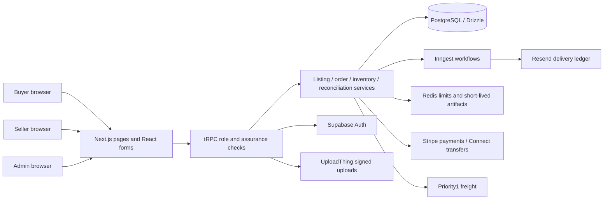

# Product, Architecture and Readiness Review — 2026-09-08

## Scope and evidence

Local base: `7df15b46ba982625f9508df89da72efc80d8c245`, initially clean. This is a source review plus executed local checks and public-browser inspection, not certification of all authenticated workflows. The source is authoritative over old project reports. See [production plan](../PLANK_MARKET_PRODUCTION_PLAN.md) for decisions and priorities.

Evidence artifacts are in `tmp/product-review-2026-09-08/`: validated read-only graph, three node results, deterministic reduction, independent source verification, test logs, existing-target schema/data checks, and before/after browser captures. These temporary artifacts remain local. The graph's first reduction rejected a supplemental test anchor; the policy correction and original rejection were retained. One fresh-context worker failed before executing because the runtime chose an unavailable model. An independent worker reopened the anchors with inherited context; that is not a fulfilled fresh-context check.

The local configured database and auth project both resolve to `dmznwutpmqalodcjxcjf`. Its read-back returned 22 users, zero listings and zero orders. Its schema contract passed and the data audit reported no violations. Empty transaction tables cannot demonstrate operational correctness or traction. Supabase connector discovery exposed Plank & Go and a schema scratch project, not the auth project configured here. Deployment listing returned a newer production-target commit than this checkout. No provider/deployment state was changed.

## Product model and business decision

The coherent present-day product is a **seller-owned inventory-lot marketplace**. A flooring business posts one available lot with product attributes, package conversion, origin and commercial terms. A buyer finds the lot, negotiates or buys it, receives an itemized checkout and follows one freight shipment/order. There is no multi-seller cart. Seller and buyer accounts are exclusive roles; real businesses that both buy and sell need a future organization/membership model.

Recommended launch hypothesis: verified distributors or liquidators with pallet-scale unused overstock and discontinued inventory, serving contractors and retailers in a region with committed supply. Builders/property managers may be secondary buyers when their projects fit available lots. Individual consumers, isolated small remnants, manufacturers' full catalogs and complex multi-warehouse distribution should wait. This is a product judgment grounded in the current workflow, not market-demand evidence.

The flywheel depends on usable local selection and availability accuracy: assisted supplier imports → fresh searchable lots with credible specs/origins → useful buyer inquiries and delivered quotes → completed transactions → repeat supplier stock. The weakest measured link today is not feature quantity: the candidate environment has no inventory to exercise that loop.

## Actual application architecture

Next.js route groups divide marketing, marketplace, dashboard and admin surfaces. tRPC registration (`src/server/routers/_app.ts`) exposes the implemented capabilities. Zustand holds client auth/UI state; TanStack Query/tRPC drives server data. Drizzle schema, SQL migration history and target readiness contract are separate evidence sources.

Keep this modular monolith. Its major scaling risks are query/data quality, external retry semantics, operational bottlenecks and coupling in large routers; a microservice rewrite would not solve the identified product gaps.

## Review coverage and gaps

| Requested area | Current implementation / observed behavior | Gap and disposition |
|---|---|---|
| Users and marketplace wedge | B2B buyers/sellers/admin; business verification; seller identity masking | Validate regional lot market; organization memberships later |
| Supply creation | Manual wizard, duplicate/import-related tools, Pro CSV drafts, AI draft extraction | Rehearse first listing and error correction with actual supplier sheet; bulk access friction deserves validation |
| Feeds | Inventory source/item binding, idempotent batches, adjustments and reconciliation | Quantity sync, not manufacturer product catalog import |
| Flooring inventory | Material, species, finish, grade, brand/model, dimensions, wear layer, condition, area, cartons-per-pallet and MOQ | No real product/variant/warehouse/batch entities; no reliable waterproof, installation or warranty spec |
| Packaging/pricing | Exact-money columns; area/carton conversion; direct purchase/offer rules; carton multiples checked in orders | Explicit carton counts and batch identity should be added from evidence, not guessed |
| Buyer discovery | Public browse/detail, material/condition hubs, many facets, watchlists, alerts | Browse geography/dimensions fixed locally; full phrase matching remains limited |
| Search examples | Literal generated search document across title, description, brand, species | No cross-field token semantics, typo normalization, model-number index or natural-language constraints |
| Geography | ZIP coordinates, bounding box plus distance expression, territorial eligibility | ZIP-edit and nationwide-nearest defects fixed; independent warehouse origin still unsupported |
| Delivery | LTL quotes, quote caching/binding, pallet requirements, BOL/tracking/cancellation | Pickup/local-delivery preferences are not proof of full fulfillment modes; multi-location shipping is blocked deliberately |
| Pricing and fees | Ask/direct-purchase price, offers, volume/partial-lot rules, buyer/seller fees, processing and freight allocation | Recommendations now use browse's purchase price; validate delivered totals and tax policy with real test flows |
| Trust | Verification drafts/review, ratings, reports, disputes, masking, confirmation expiry | Verification is not guaranteed inventory authenticity or product performance |
| Seller operations | Listing create/edit, inventory feeds, order management, CRM, analytics, samples, payments | Authenticated mobile photo/import/stock rehearsal missing; many tools need discoverability validation |
| Admin operations | Users, listings, orders, finance, reconciliation, shipments, disputes, moderation, verification, settings | No independent catalog/category/warehouse CRUD model; rehearsals must prove routine SQL is unnecessary |
| Monetization | Dual commissions, freight margin, Pro subscription, promotion infrastructure | Promotion purchase UI is disabled while monthly credit is advertised; do not sell unsupported benefit |
| Data quality | Enums and validators; normalized states and commercial rules | Separate family from construction, finish from texture, sale reason from physical condition |
| Visual design | Cohesive cream/brown/green palette, display headings, responsive public pages | Long mobile signup/empty state, sparse real product evidence; see separate scored report |
| Conversion | Guest browse → account/verification → protected actions; zero-result alert/request capture | Reduce irrelevant choices at early activation; count and instrument actual journey completions |
| Mobile | Public forms and navigation rendered at 390px without overflow | Authenticated upload, listing edit, checkout, order and admin behavior not manually established |
| Database integrity | FK/check/index strategy; ownership lineage; audit and reconciliation models | Seven migration-history gaps prevent clean bootstrap; verify restoration before launch |
| Scale | Bounded listing result window, short public caches, geo bounding boxes, relational queries | Deep pagination ceiling is explicit; token/search indexes and cursor paging needed before millions of rows |
| Permissions | Server tRPC roles/ownership, admin assurance checks, scoped public DTOs | Observed broken anonymous redirects; aligned middleware with src/app, regenerated development cache and added regression coverage |
| Upload/security | Signed upload callbacks, uploader ownership, content sniffing, private evidence access controls | Provider configuration/access-policy read-back still missing |
| Reliability | Payment event inbox, idempotency, reservation row locks, retry/reconciliation | Conditional incomplete transfer-history risk and expiry starvation remain material |
| Payments/orders | Single-listing reservation → payment → shipment → delayed seller transfer; fees/snapshots | No regulated escrow. Partial application refunds before payout intentionally rejected; initial concern was a false positive |
| Inventory integrity | Reservation locks, guarded edits/archive, feed adjustments, 14-day reconfirmation | Show original vs available stock clearly; existing data backfills separately authorized |
| Cleanup | Core routes/services are registered and interconnected | No evidence justifies broad deletion; classify disabled/legacy tools before removing |
| Analytics | Typed PostHog events, consent/property sanitization, server events, seller metrics | Add impression/click cohorts and geographic liquidity; keep payment/accounting truth separate from browser analytics |
| SEO | Server-rendered details, metadata, canonicals, sitemap, category/condition hubs, JSON-LD | Removed false used classification; brand/city landing pages require real stock and stronger taxonomy |
| AI | Existing extraction/draft assistance and verification tools | Assist catalog/spec matching with provenance; never invent product specs or auto-publish unsupported claims |
| Economics/flywheel | Potential revenue paths exist in software | No genuine supplier commitments, settled trades, carrier invoices or repeat-use evidence supplied |
| Verification | Baseline full tests and public E2E passed; precise post-change checks recorded separately | No paid shipment, money movement, messaging or account creation performed |

## Key technical findings

### Geographic and dimensional correctness — fixed locally

`src/server/routers/listing.ts` previously updated ZIP without latitude/longitude, derived buyer coordinates only when radius was present, applied ±0.1 inch thickness tolerance, and treated the 9-inch-plus filter as 8.9–9.1 inches. Regression tests exercise the actual router and generated predicates. Nearest now precedes promotion placement and uses stable ID ordering. Unknown coordinates remain NULL rather than receiving an invented trigonometric result (`listing-geo.ts`). Invalid buyer ZIPs receive visible feedback.

### Unsupported product guarantees — contained, data model still incomplete

`matching.ts` used `wearLayer > 0` for waterproof requirements. That could recommend engineered wood without supporting performance evidence. The route now withholds those recommendations and returns an explicit limitation consumed by the buyer dashboard. A manufacturer-specific waterproof claim should retain its source and conditions; it cannot be derived from thickness alone. [Pergo's product-specific waterproof and warranty information](https://www.pergoflooring.com/shop/luxury-vinyl/extreme-options/detail/PT008-956/after-rain) illustrates the need for product evidence rather than a generic numeric proxy.

### Legacy transfer recovery — conditional launch blocker

`src/server/services/stripe-order-transfer.ts` scans at most ten 100-item legacy pages and returns `undefined` when `has_more` remains true. Callers can interpret that as no previous transfer. If an orphan legacy transfer lies beyond that window, payout retry or refund recovery can be wrong. The current test explicitly expects the incomplete scan to return undefined; passing tests therefore do not establish safe semantics.

Target change: an explicit incomplete-history result/error, no new payout/refund step until reconciliation resolves it, and tests for scan cap, malformed pagination, multiple matches, orphan recovery and aged retry. [Stripe documents that idempotency keys may be removed after at least 24 hours](https://docs.stripe.com/api/idempotent_requests); a key alone is not durable proof that no transfer exists. No production incident was established. Money-flow behavior needs a separately reviewed change under the project's transaction boundaries.

### Expiry fairness — remaining

`src/app/api/cron/expire-pending-orders/route.ts` selects the oldest 25 eligible pending orders. Captured/provider-succeeded candidates are skipped without leaving the candidate set. A persistent oldest batch can prevent later unpaid reservations from expiring. Target: bounded pagination or persisted reconciliation/defer state, maintaining the rule that captured payments cannot be blindly cancelled. Reproduce with 25 skipped candidates plus a later unpaid candidate before implementation.

### Route protection wiring — discovered by execution

Anonymous requests to `/buyer`, `/seller/listings/new` and `/admin` returned 200 without a server redirect. Buyer/seller shells displayed a promise to redirect but did not navigate. The session/assurance entry was moved to `src/middleware.ts` to follow the [Next.js src-directory convention](https://nextjs.org/docs/pages/api-reference/file-conventions/src-folder), and stale development cache was regenerated. Installed Next also recognizes root middleware, so placement alone is not a proven cause. Final browser checks establish correct redirects and preserved destinations for all three roles. Backend tRPC checks are retained; no data leak was demonstrated.

## Canonical taxonomy and additive target model

- Material family: hardwood, engineered wood, laminate, vinyl, bamboo, tile, other. Normalize LVP/luxury-vinyl-plank/vinyl plank to vinyl family with plank format; SPC/WPC identify construction, not separate competing top-level synonyms.
- Identity: manufacturer + normalized brand + manufacturer model/SKU + variant; seller's external SKU remains a separate binding. Preserve original source text.
- Units: canonical dimensions in documented units; wear-layer mm plus display conversion, package area in sqft, quantities in integer cartons when supplied. Reject impossible conversion, do not round silently at sale.
- Lot: physical condition distinct from closeout/discontinued sale reason; batch/dye lot, warehouse, available quantity, confirmation provenance and timestamp.
- Performance: installation method, waterproof state/source, AC rating where applicable, commercial/residential warranty source and compatible accessory references. Unknown remains searchable as unknown, not false or implicitly verified.
- Migration strategy: nullable links and compatibility reads first, then validated backfill per supplier; immutable order specifications/origin/prices remain snapshots. No destructive schema replacement.

## Analytics and operating metrics

Keep the typed event architecture. Add a pseudonymous search/session key connecting result impressions and clicks, filter use, detail visit, qualified request, offer, checkout and completed order. Do not include raw ZIP/search text where privacy policy excludes it. Report inventory value at available direct-purchase price separately from GMV and revenue; use authoritative paid/refunded orders for money.

Operator metrics: fresh purchasable listings by region/material, available usable area, confirmation age, search with no results, time to qualified response, seller first-publish rate, quote-to-order, shipping completion, dispute rate, repeat buyer and supplier retention. Treat sample/seed records explicitly and exclude them from traction.

## AI opportunity ranking

| Rank | Opportunity | Expected impact / complexity | Authority |
|---|---|---|---|
| 1 | Extract specs and package area from supplier sheets/packaging into reviewable drafts | High / Medium | Human verifies source and publishes |
| 2 | Match SKU/catalog and propose normalization/duplicates | High / Medium | Never auto-merge stock or infer batch identity |
| 3 | Assist stock-import exception resolution | High / Medium | Deterministic quantity rules; operator resolves ambiguity |
| 4 | Natural-language query to existing validated filters | Medium / Medium | Show interpreted constraints; no invented availability |
| 5 | Recommendations and pricing suggestions | Unvalidated / High | Advisory until local demand and sale history support them |

## Coverage limits and next evidence

The entire supplied definition of done is **not met**. Source inspection and empty-state rendering cannot certify buyer purchases, seller onboarding/uploads or admin operations. Required next inputs are a dedicated populated staging setup and role accounts. Then execute the plan's flows with test providers, verify retry behavior, compare provider records and rehearse recovery. Broad rewrites and destructive dead-code deletion are not warranted by this evidence.

## Final verification record

- Baseline: 169 files / 1,152 tests, typecheck, lint, local migration checks, 62 shipping tests and provider-free shipping smoke passed.
- Post-change suite: 170 files / 1,163 tests passed. After the subsequent isolated cache correction, the cache/listing regression set passed 13 tests, including three new cache cases. Application and test typechecking and final lint are recorded in the run logs.
- Normal production build: code compiled and TypeScript completed, but page-data collection failed required environment validation. Missing local keys: `RESEND_WEBHOOK_SECRET`, `INNGEST_EVENT_KEY`, `INNGEST_SIGNING_KEY`, `ANTHROPIC_API_KEY`, `VERIFICATION_DOC_ALLOWED_HOSTS`, `PRIORITY1_DOCUMENT_ALLOWED_HOSTS`. No bypass was used to claim a successful production build.
- A rerun after the entry change and failed production build encountered stale development route cache and 404 destinations. Cache was preserved in `node_modules/.cache/plankmarket-review-20260908-dev`, regenerated, and public pages returned 200. Initial failed logs remain recorded. Moving the archived generated types outside the TypeScript input set also resolved a review-artifact-only typecheck failure.
- The final route/capture result is separate from prior successful source checks. Authenticated successful commerce remains unavailable without dedicated sessions and populated test inventory.

### Public cache correction

Runtime logs repeatedly reported `SyntaxError` for public cache reads. `public-read-cache.ts` called SuperJSON text parsing even when the Redis SDK returned an already decoded object. It now handles either representation with SuperJSON, preserving typed dates and the existing fallback on malformed data. Tests exercise both SDK response forms and malformed-entry recovery. No Redis global configuration or existing business record was changed.

Final public E2E read-back: **12/12 passed** in 27.1 seconds across desktop/mobile, including the six added signed-out redirect cases. Final lint and test typecheck passed.
