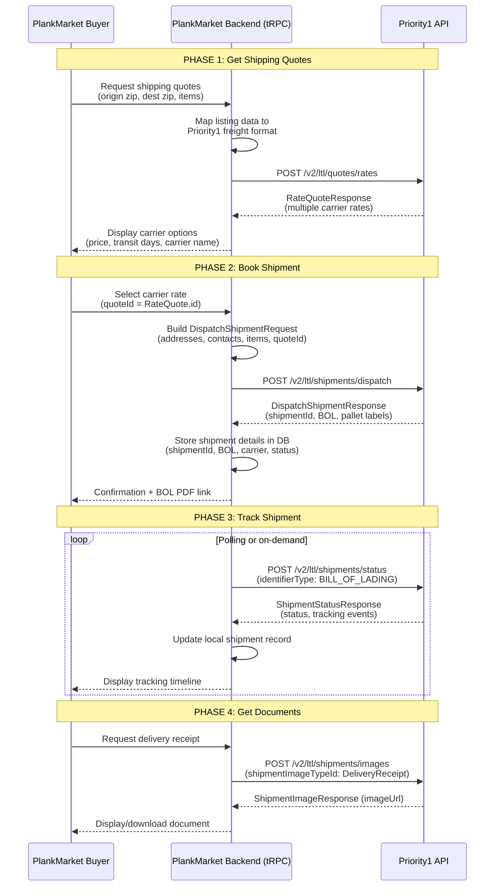
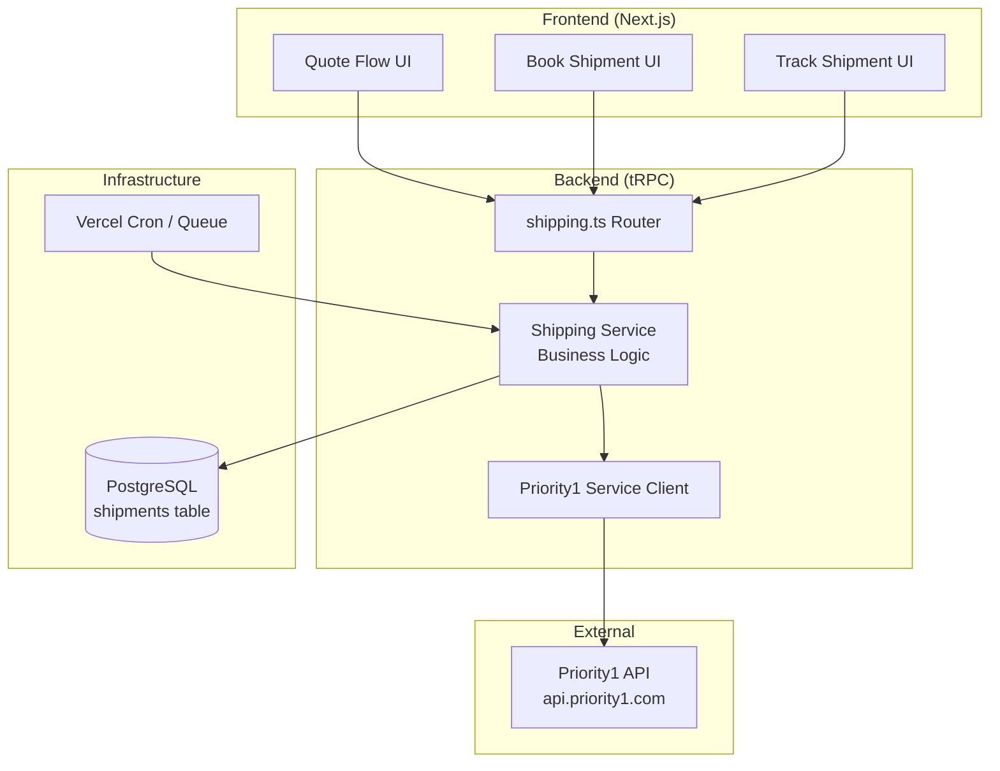

# Priority1 Shipping API -- Integration Analysis for PlankMarket

**Date:** 2026-02-12
**Author:** Architecture Team
**Status:** Analysis Complete -- Pending Decision
**Source Document:** `/Users/tsc-001/Desktop/v2.json` (OpenAPI 3.0.1, v2.0)

---

## Table of Contents

1. [API Overview](#1-api-overview)
2. [Core Endpoints Inventory](#2-core-endpoints-inventory)
3. [Key Data Models](#3-key-data-models)
4. [Authentication & Authorization](#4-authentication--authorization)
5. [Integration Flow](#5-integration-flow)
6. [Webhook/Callback Support](#6-webhookcallback-support)
7. [Rate Limiting & Constraints](#7-rate-limiting--constraints)
8. [Error Handling](#8-error-handling)
9. [Key Considerations for PlankMarket Integration](#9-key-considerations-for-plankmarket-integration)
10. [Recommendations](#10-recommendations)

---

## 1. API Overview

| Attribute | Value |
|---|---|
| **Spec Format** | OpenAPI 3.0.1 (JSON) |
| **API Name** | Priority1 API |
| **Version** | 2.0 |
| **Type** | REST (JSON over HTTPS) |
| **Base URL** | Not declared in spec (inferred: `https://api.priority1.com`) |
| **Path Prefix** | `/v2/` on all endpoints |
| **Versioning** | URL path-based (`/v2/...`) |
| **Auth** | API Key via `X-API-KEY` header (global security scheme) |
| **Content Type** | `application/json` exclusively |
| **Support Contact** | support@priority1.com |

**What it is:** Priority1 is a freight brokerage platform that aggregates multiple LTL (Less-Than-Truckload), Truckload (TL), and Parcel carriers behind a single API. They act as an intermediary -- you get quotes from multiple carriers, pick one, and dispatch/track through Priority1.

**Three shipping modes supported:**

| Mode | Best For (PlankMarket Context) |
|---|---|
| **LTL** | Partial pallet loads of flooring; most common for B2B lumber |
| **Truckload (TL)** | Full truckloads for large bulk orders |
| **Parcel** | Small sample shipments (limited availability, "some Cabotage customers" only) |

**Key observation:** LTL is by far the most feature-rich mode in this API and the most relevant for PlankMarket's B2B lumber marketplace. Lumber/flooring shipments are overwhelmingly LTL freight.

---

## 2. Core Endpoints Inventory

### 2.1 Admin / Invoicing

| Method | Path | Description | Tags |
|---|---|---|---|
| `GET` | `/v2/admin/customerinvoices` | Get customer invoices by BOL number | Customer Invoices |

### 2.2 LTL Quotes (PRIMARY for PlankMarket)

| Method | Path | Description | Tags |
|---|---|---|---|
| `POST` | `/v2/ltl/quotes/rates` | Create a quote -- returns multiple carrier rates with transit times | LTL Quotes |
| `POST` | `/v2/ltl/quotes/suggestedclass` | Get suggested freight class based on weight + dimensions | LTL Quotes |

### 2.3 LTL Shipments (PRIMARY for PlankMarket)

| Method | Path | Description | Tags |
|---|---|---|---|
| `POST` | `/v2/ltl/shipments/dispatch` | Dispatch/book a shipment (requires quoteId) | LTL Shipments |
| `POST` | `/v2/ltl/shipments/create` | Create shipment WITHOUT a quote (requires carrier SCAC; restricted access) | LTL Shipments |
| `POST` | `/v2/ltl/shipments/collect` | Create a collect shipment (bill-to receiver/third-party) | LTL Shipments |
| `POST` | `/v2/ltl/shipments/cancel` | Cancel a shipment by shipment ID | LTL Shipments |
| `POST` | `/v2/ltl/shipments/status` | Get shipment status/tracking by identifier | LTL Shipments |
| `POST` | `/v2/ltl/shipments/images` | Get shipment documents (BOL, delivery receipt, etc.) | LTL Shipments |
| `POST` | `/v2/ltl/shipments/addreference` | Add reference numbers to existing shipment | LTL Shipments |
| `POST` | `/v2/ltl/shipments/import` | Import a shipment into Priority1 (restricted access) | LTL Shipments |
| `POST` | `/v2/ltl/shipments/exla-tracking` | EXLA carrier tracking webhook endpoint (inbound) | LTL Shipments |

### 2.4 Parcel Quotes

| Method | Path | Description | Tags |
|---|---|---|---|
| `POST` | `/v2/parcel/quotes/rates` | Create a parcel quote -- returns carrier rates | Parcel Quotes |

### 2.5 Parcel Shipments

| Method | Path | Description | Tags |
|---|---|---|---|
| `POST` | `/v2/parcel/shipments/dispatch` | Dispatch a parcel shipment | Parcel Shipments |
| `POST` | `/v2/parcel/shipments/status` | Get parcel shipment status/tracking | Parcel Shipments |
| `POST` | `/v2/parcel/shipments/images` | Get parcel shipment labels/images | Parcel Shipments |

### 2.6 Truckload Quotes

| Method | Path | Description | Tags |
|---|---|---|---|
| `POST` | `/v2/tl/truckloadquotes/rates` | Create a truckload quote -- returns rates + transit times | Truckload Quotes |

### 2.7 Truckload Shipments

| Method | Path | Description | Tags |
|---|---|---|---|
| `POST` | `/v2/tl/truckloads/create` | Create/book a truckload (requires quoteRateId) | Truckloads |
| `POST` | `/v2/tl/truckloads/status` | Get truckload status/tracking | Truckloads |
| `POST` | `/v2/tl/truckloads/images` | Get truckload documents | Truckloads |
| `POST` | `/v2/tl/truckloads/cancel` | Cancel a truckload | Truckloads |
| `GET`  | `/v2/tl/truckloads/contractedlanes` | Get all contracted lanes for customer | Truckloads |
| `POST` | `/v2/tl/truckloads/dispatchcontractedlanes` | Dispatch on a contracted lane | Truckloads |

**Total: 21 endpoints** (1 GET for invoices, 1 GET for contracted lanes, 19 POST)

**Architectural note:** Nearly all endpoints use POST, even for read-like operations (status, images). This is unusual for REST -- it is a command-style RPC API with REST-like URLs. Status/tracking use POST because they require a request body to specify the identifier type and value.

---

## 3. Key Data Models

### 3.1 LTL Rate Quote Request (the starting point)

```
RateQuoteRequest {
  originZipCode*:       string    // REQUIRED - 5-digit ZIP
  destinationZipCode*:  string    // REQUIRED - 5-digit ZIP
  pickupDate*:          datetime  // REQUIRED - ISO 8601
  items*:               QuoteLineItem[]  // REQUIRED - at least 1 item

  // Optional location details
  originCity:            string?
  originStateAbbreviation: string?
  originCountryCode:     string?   // US, CA, MX, PR
  destinationCity:       string?
  destinationStateAbbreviation: string?
  destinationCountryCode: string?

  // Optional
  enhancedHandlingUnits: QuoteEnhancedHandlingUnit[]?
  accessorialServices:   AccessorialService[]?  // e.g., LGPU, APPT
  apiConfiguration:      { timeout: int? }      // default 15 seconds
}
```

### 3.2 QuoteLineItem (what you are shipping)

```
QuoteLineItem {
  freightClass*:  enum    // REQUIRED - "50" through "500" (18 values)
  packagingType*: enum    // REQUIRED - Pallet, Box, Crate, etc. (20 values)
  units*:         int     // REQUIRED - number of handling units
  totalWeight*:   decimal // REQUIRED - pounds
  length*:        decimal // REQUIRED - inches
  width*:         decimal // REQUIRED - inches
  height*:        decimal // REQUIRED - inches

  pieces:         int     // pieces per unit
  isStackable:    bool    // default false
  isHazardous:    bool    // default false
  isUsed:         bool    // default false
  isMachinery:    bool    // default false
  nmfcItemCode:   string? // NMFC code (with nmfcSubCode)
  nmfcSubCode:    string? // NMFC sub-code
  description:    string?
}
```

### 3.3 Rate Quote Response (what you get back)

```
RateQuoteResponse {
  id:               int              // Priority1 quote batch ID
  rateQuotes:       RateQuote[]      // successful carrier quotes
  invalidRateQuotes: RateQuoteError[] // failed carrier quotes
  rateQuoteRequestDetail: {          // echo of request + computed fields
    originZipCode, destinationZipCode, pickupDate,
    items[], enhancedHandlingUnits[], accessorialServices[],
    linearFeet: int,     // COMPUTED by Priority1
    distance:   double,  // COMPUTED - miles between origin/dest
    totalWeight: decimal  // COMPUTED
  }
}
```

### 3.4 Individual RateQuote (one carrier's offer)

```
RateQuote {
  id:               int      // Rate quote ID -- NEEDED for dispatch
  carrierName:      string   // e.g., "Southeastern Freight"
  carrierCode:      string   // SCAC code, e.g., "SEFL"
  serviceLevel:     string   // "STANDARD" etc.
  transitDays:      int      // business days
  laneType:         string   // "DIRECT", "INTERLINE", "UNSPECIFIED"
  deliveryDate:     datetime?
  effectiveDate:    datetime?
  expirationDate:   datetime? // IMPORTANT: quote expires
  carrierQuoteNumber: string?

  // Carrier liability amounts
  totalNewCarrierLiabilityAmount:       decimal
  totalUsedCarrierLiabilityAmount:      decimal
  totalMachineryCarrierLiabilityAmount: decimal

  rateQuoteDetail: {
    total:   decimal    // THE PRICE
    charges: Charge[]   // breakdown (FSC, GFC, discounts, etc.)
  }
}
```

### 3.5 Dispatch Shipment Request (booking a shipment)

```
DispatchShipmentRequest {
  originLocation*: {
    address*: { addressLine1*, city*, state*, postalCode*, country* }
    contact*: { companyName*, phoneNumber*, contactName?, email? }
  }
  destinationLocation*: { /* same structure */ }
  lineItems*:      ShipmentLineItem[]  // description is REQUIRED here (not in quote)
  pickupWindow*:   { date*, startTime*, endTime* }  // format: "MM/dd/yyyy", "HH:mm"
  deliveryWindow*: { date*, startTime*, endTime* }

  quoteId:         int     // References the RateQuote.id from quoting step
  insuranceAmount: decimal // recommended for full declared value

  // Optional
  enhancedHandlingUnits: ShipmentEnhancedHandlingUnit[]?
  shipmentIdentifiers:   ShipmentIdentifier[]?  // customer refs, PO numbers
  shipmentEmergencyContact: { name?, phoneNumber? }  // required for hazmat
  pickupNote:      string?
  deliveryNote:    string?
}
```

### 3.6 Dispatch Shipment Response (confirmation)

```
DispatchShipmentResponse {
  id:                    int       // Priority1 shipment ID -- key for tracking
  shipmentIdentifiers:   ShipmentIdentifier[]  // includes BOL, PICKUP numbers
  capacityProviderBolUrl: string?  // PDF link for Bill of Lading
  capacityProviderPalletLabelUrl: string?   // PDF link for pallet labels
  capacityProviderPalletLabelExtendedUrl: string?
  capacityProviderPalletLabelsUrl: string?
  pickupNote:            string?
  estimatedDeliveryDate: datetime?
  infoMessages:          Message[]  // warnings/errors from carrier
}
```

### 3.7 Shipment Status / Tracking

```
ShipmentStatusRequest {
  identifierType*: enum   // BILL_OF_LADING, PRO, CUSTOMER_REFERENCE, etc.
  identifierValue*: string
}

ShipmentStatusResponse {
  shipments: TrackedShipment[] {
    id:                  int
    pickupLocation:      Location
    destinationLocation: Location
    carrierCode:         string
    carrierName:         string
    status:              string   // "Dispatched", "In Transit", "Delivered",
                                  // "Canceled", "Exception"
    actualPickupDate:    datetime?
    actualDeliveryDate:  datetime?
    shipmentIdentifiers: ShipmentIdentifier[]
    trackingStatuses:    TrackingStatus[]  // chronological event log
    totalCost:           decimal
  }
}

TrackingStatus {
  timeStamp:     datetime
  addressLineOne: string?
  city:          string?
  state:         string?
  postalCode:    string?
  status:        string    // "In Transit", "Completed", etc.
  statusReason:  string?   // carrier-provided description
}
```

### 3.8 Key Enums

| Enum | Values | Notes |
|---|---|---|
| **FreightClassType** | 50, 55, 60, 65, 70, 77.5, 85, 92.5, 100, 110, 125, 150, 175, 200, 250, 300, 400, 500 | Lumber is typically Class 60-85 |
| **PackagingType** | Bag, Bale, Box, Bucket, Bundle, Can, Carton, Case, Coil, Crate, Cylinder, Drums, Pail, Pieces, Pallet, Reel, Roll, Skid, Tube, Tote | Lumber: Pallet, Bundle, Crate, Skid |
| **IdentifierType (LTL)** | PRO, BILL_OF_LADING, CUSTOMER_REFERENCE, PICKUP, PURCHASE_ORDER, EXTERNAL, SALES_ORDER | |
| **ShipmentImageType** | BillOfLading, DeliveryReceipt, WeightCertificate, Invoice, PalletLabel, ... (40+ values) | |
| **ImageFormat** | PDF, TIF, PNG, GIF, JPG | |
| **DimensionUnit** | in, ft, cm, m | LTL uses inches |
| **WeightUnit** | lbs, kg | LTL uses pounds |
| **TruckloadEquipmentType** | 53_Foot_Dry_Van, Sprinter_Van, Straight_Truck, Large_Straight_Truck, Small_Straight_Truck, 53_Foot_Flatbed, 48_Foot_Flatbed, 53_Foot_Step_Deck, 48_Foot_Step_Deck | |

---

## 4. Authentication & Authorization

### Mechanism

- **Type:** API Key
- **Header:** `X-API-KEY`
- **Scope:** Global -- all endpoints require this header
- **No OAuth, no JWT, no token refresh** -- single static API key

### Security Implications

| Concern | Assessment |
|---|---|
| **Key rotation** | Not documented. Need to confirm with Priority1 how key rotation works. |
| **Per-user keys** | Not supported. PlankMarket will use a SINGLE API key for all operations. Users do NOT authenticate directly to Priority1. |
| **Rate limiting per key** | 429 responses documented on quote endpoints, but no specific limits stated. |
| **IP allowlisting** | Not documented. Clarify with Priority1 if available/required for production. |

### Architecture Consequence

PlankMarket acts as a **server-side proxy**. The Priority1 API key MUST only be used from server-side code (tRPC procedures, API routes). It must NEVER be exposed to the client browser. All Priority1 API calls must flow through PlankMarket's backend.

---

## 5. Integration Flow

### 5.1 End-to-End Happy Path (LTL -- Primary Flow)



### 5.2 Data Flow Between Steps

```
QUOTE PHASE                    BOOK PHASE                     TRACK PHASE
-----------                    ----------                     -----------
Input:                         Input:                         Input:
  originZipCode       -------> originLocation (full address)  shipmentId or
  destinationZipCode  -------> destinationLocation            BOL number
  pickupDate          -------> pickupWindow
  items[]:                     lineItems[] (+ description)    Output:
    freightClass               quoteId (from quote response)  status string
    packagingType              shipmentIdentifiers            trackingStatuses[]
    units                      pickupNote / deliveryNote      actualPickupDate
    totalWeight                insuranceAmount                actualDeliveryDate
    dimensions                 emergencyContact (if hazmat)   totalCost

Output:                        Output:
  RateQuote.id =============> (used as quoteId)
  carrier rates               shipmentId ==================> (used for tracking)
  transit days                BOL number ==================> (used for tracking)
  expiration dates            PDF URLs (BOL, labels)
  distance / linearFeet       estimatedDeliveryDate
```

### 5.3 Required vs Optional Fields by Phase

#### Phase 1: Quoting (Minimum Viable)

| Field | Required | Source in PlankMarket |
|---|---|---|
| originZipCode | YES | Seller's `businessZip` or `zipCode` from `users` table |
| destinationZipCode | YES | Buyer's shipping ZIP (from order or user input) |
| pickupDate | YES | User selection or default to next business day |
| items[].freightClass | YES | **GAP** -- Must compute from weight/dims or ask user; can use `/suggestedclass` |
| items[].packagingType | YES | Default to "Pallet" for lumber; seller can override |
| items[].units | YES | Derive from order quantity |
| items[].totalWeight | YES | **GAP** -- Must collect from seller or compute from listing data |
| items[].length | YES | **GAP** -- Must collect from seller or compute from listing dimensions |
| items[].width | YES | **GAP** -- Must collect |
| items[].height | YES | **GAP** -- Must collect |

#### Phase 2: Booking (Additional fields beyond quoting)

| Field | Required | Source in PlankMarket |
|---|---|---|
| originLocation.address (full) | YES | Seller's business address from `users` table |
| originLocation.contact | YES | Seller's name, phone from `users` table |
| destinationLocation.address | YES | Buyer's shipping address from `orders` table |
| destinationLocation.contact | YES | Buyer's name, phone |
| lineItems[].description | YES | Listing title or product description |
| pickupWindow | YES | User selection |
| deliveryWindow | YES | User selection or carrier estimate |
| quoteId | YES (for dispatch) | From RateQuoteResponse in Phase 1 |

---

## 6. Webhook/Callback Support

### Outbound Webhooks (Priority1 pushing to PlankMarket): NOT SUPPORTED

The API spec does **not** document any webhook registration endpoints. There is no mechanism to register a callback URL for tracking updates, status changes, or delivery notifications.

### Inbound Webhook (PlankMarket receiving from EXLA)

There is one endpoint: `POST /v2/ltl/shipments/exla-tracking` -- this is an EXLA-specific tracking webhook that Priority1 _receives_, not something PlankMarket would use.

### Consequence for PlankMarket

**Tracking must be poll-based.** PlankMarket will need to implement a background job (cron or queue) that periodically calls `POST /v2/ltl/shipments/status` for all active shipments to check for status updates.

Recommended polling strategy:
- Active/In Transit shipments: Every 2-4 hours
- Recently dispatched (first 24h): Every 1 hour
- Near expected delivery: Every 1 hour
- Delivered/Cancelled: Stop polling

---

## 7. Rate Limiting & Constraints

### Documented Constraints

| Constraint | Evidence |
|---|---|
| **429 Too Many Requests** | Documented on quote endpoints (`/v2/ltl/quotes/rates`, `/v2/parcel/quotes/rates`, `/v2/tl/truckloadquotes/rates`) |
| **Specific rate limits** | NOT documented in the spec. Must be confirmed with Priority1. |
| **Quote expiration** | Quotes have `expirationDate` field (example shows ~7 day expiry). Shipments must be dispatched before expiration. |
| **Carrier timeout** | Configurable via `apiConfiguration.timeout` (default: 15 seconds). This is the time Priority1 waits for carrier responses. |
| **Restricted endpoints** | `POST /v2/ltl/shipments/create` -- "Not available to all customers." `POST /v2/ltl/shipments/import` -- "Not available for all customers." `POST /v2/parcel/quotes/rates` -- "Available only to some Cabotage customers." |

### Things NOT documented that should be clarified

- Requests per minute/hour/day per API key
- Concurrent request limits
- Payload size limits
- Sandbox/test environment availability
- Whether quote endpoint calls (which fan out to multiple carriers) are more expensive than other calls

---

## 8. Error Handling

### HTTP Status Codes Used

| Code | Meaning | Used On |
|---|---|---|
| `200` | Success | All endpoints |
| `401` | Unauthorized (invalid/missing API key) | All endpoints |
| `403` | Forbidden (valid key but insufficient permissions) | Quote and dispatch endpoints |
| `404` | Not Found | Cancel endpoints only |
| `429` | Too Many Requests | Quote endpoints only |
| `500` | Server Error | All endpoints |

### Error Response Structure

All 500 errors return an array of `Message` objects:

```json
[
  {
    "severity": "Error",        // "Error", "Warning", "Info", "CapacityError"
    "text": "Human-readable error message",
    "source": "SYSTEM" | "CAPACITY_PROVIDER",
    "id": null                  // LTL only; nullable int
  }
]
```

### Partial Failures in Quote Responses

Quote responses include BOTH successful and failed carrier quotes:
- `rateQuotes[]` -- successful quotes
- `invalidRateQuotes[]` -- failed quotes with carrier-specific error messages

This is a "partial success" pattern. A 200 response can contain failed carrier quotes alongside successful ones. PlankMarket should display available quotes even when some carriers fail.

### Info Messages in Dispatch Responses

Dispatch responses include `infoMessages[]` which can contain warnings even on successful dispatches. Example from the spec:

```json
{
  "severity": "Error",
  "text": "Vendor EXLA is not supported for Prepro.",
  "source": "SYSTEM"
}
```

These should be logged and potentially surfaced to PlankMarket admins, but may not indicate failure of the dispatch itself.

---

## 9. Key Considerations for PlankMarket Integration

### 9.1 Data Mapping: PlankMarket to Priority1

| PlankMarket Field | Priority1 Field | Mapping Notes |
|---|---|---|
| `users.businessZip` / `users.zipCode` | `originZipCode` | Seller's location |
| `orders.shippingZip` | `destinationZipCode` | Buyer's delivery location |
| `users.businessAddress` | `originLocation.address.addressLine1` | Full address needed for booking |
| `users.businessCity` | `originLocation.address.city` | |
| `users.businessState` | `originLocation.address.state` | |
| `users.businessName` | `originLocation.contact.companyName` | |
| `users.name` | `originLocation.contact.contactName` | |
| `users.phone` | `originLocation.contact.phoneNumber` | |
| `users.email` | `originLocation.contact.email` | |
| `orders.shippingName` | `destinationLocation.contact.contactName` | |
| `orders.shippingAddress` | `destinationLocation.address.addressLine1` | |
| `orders.shippingCity` | `destinationLocation.address.city` | |
| `orders.shippingState` | `destinationLocation.address.state` | |
| `orders.shippingZip` | `destinationLocation.address.postalCode` | |
| `orders.shippingPhone` | `destinationLocation.contact.phoneNumber` | |
| `orders.trackingNumber` | `shipmentIdentifiers[type=BILL_OF_LADING].value` | Store after dispatch |
| `orders.carrier` | `carrierName` or `carrierCode` | Store after dispatch |
| `listings.title` | `lineItems[].description` | Required for dispatch |

### 9.2 Critical Data Gaps

The following data is **required** by Priority1 but does NOT currently exist in PlankMarket's data model:

| Missing Data | Priority1 Field | Resolution Strategy |
|---|---|---|
| **Freight dimensions (L x W x H)** | `items[].length`, `.width`, `.height` | Add to listings schema OR collect at quote time. Lumber sellers likely know pallet dimensions. |
| **Total weight** | `items[].totalWeight` | Add to listings schema OR compute from board feet. Hardwood flooring ~3.5 lbs/sq ft. |
| **Freight class** | `items[].freightClass` | Use `/v2/ltl/quotes/suggestedclass` to auto-calculate from weight + dims, OR default to Class 70 for hardwood flooring. |
| **Packaging type** | `items[].packagingType` | Default to "Pallet" for lumber. Could be seller-selectable. |
| **Number of handling units** | `items[].units` | Compute from order quantity. E.g., if 500 sq ft ordered and a pallet holds 200 sq ft, then 3 pallets. |
| **Buyer company name** | `contact.companyName` | REQUIRED field. Many PlankMarket buyers may be individuals. Need fallback (use buyer name as company name). |
| **Pickup date/time window** | `pickupWindow` | Seller must specify. Add to UI flow. |
| **Delivery date/time window** | `deliveryWindow` | Can default or let buyer specify. |
| **Buyer phone** | `destinationLocation.contact.phoneNumber` | REQUIRED. Need to ensure buyers have phone on file or collect at checkout. |
| **Seller country** | `originLocation.address.country` | Default "US"; add to user profile if international. |
| **Destination address line 1** | `destinationLocation.address.addressLine1` | Currently `orders.shippingAddress` is TEXT (unstructured). May need to split into structured fields. |

### 9.3 Complexity Assessment by Integration Area

| Area | Complexity | Rationale |
|---|---|---|
| **Quoting** | **MEDIUM** | Straightforward API call, but requires freight-specific data (class, weight, dims) that PlankMarket does not currently collect. The UX for collecting this data without overwhelming users is the main challenge. |
| **Booking/Dispatch** | **HIGH** | Requires full structured addresses, contacts, date windows, and the quoteId. The quote-to-dispatch flow must handle quote expiration gracefully. Also requires storing the shipment state in PlankMarket's database. |
| **Tracking** | **MEDIUM** | Simple polling API, but requires a background job infrastructure. Status normalization (mapping Priority1 statuses to PlankMarket order statuses) requires careful design. |
| **Cancellation** | **LOW** | Simple API call with shipment ID. Need to handle the case where cancellation fails (shipment already picked up). |
| **Document Retrieval** | **LOW** | Simple API call. Returns URLs to PDFs. Proxy or redirect as needed. |
| **Invoice Retrieval** | **LOW** | Simple GET with BOL number. Useful for admin/accounting. |
| **Freight Class Suggestion** | **LOW** | Helpful utility to auto-fill freight class. Straightforward integration. |

### 9.4 Limitations and Concerns

1. **No webhook support** -- PlankMarket must poll for tracking updates. This adds infrastructure complexity and introduces latency in status updates.

2. **Quote expiration** -- Quotes expire (typically ~7 days based on examples). If a buyer views quotes but does not complete checkout immediately, quotes may expire. PlankMarket needs to either:
   - Re-quote at checkout time
   - Cache quotes and show expiration warnings
   - Build a "refresh quotes" flow

3. **Single API key for all customers** -- Priority1 does not support per-user authentication. All shipments are booked under PlankMarket's account. PlankMarket is responsible for billing and reconciliation.

4. **No sandbox/test environment documented** -- The spec does not mention a staging or test environment. Must confirm with Priority1 to avoid booking real shipments during development.

5. **Parcel mode is restricted** -- "Available only to some Cabotage customers." Must confirm access. For sample shipments (small boxes of flooring samples), this would be useful but may not be available.

6. **Address format mismatch** -- PlankMarket stores `shippingAddress` as unstructured TEXT. Priority1 requires `addressLine1`, `addressLine2` as separate fields. Existing orders will need address parsing or re-collection.

7. **`companyName` is REQUIRED** on contacts -- B2B is fine, but some PlankMarket buyers may be individuals. Need a fallback strategy (use personal name as company name).

8. **Freight-specific knowledge burden** -- Freight class, NMFC codes, packaging types, and accessorial services are domain-specific concepts. PlankMarket users (lumber sellers) may or may not be familiar with these. The UX should either automate these fields or provide clear guidance.

9. **Hazmat considerations** -- Some wood treatments may technically classify as hazardous materials. The API supports hazmat details but this adds complexity. Initial implementation should likely exclude hazmat support and revisit if needed.

10. **Currency** -- API supports USD and CAD. PlankMarket currently appears USD-only. Should be fine initially but worth noting for potential Canadian expansion.

---

## 10. Recommendations

### ADR-001: Shipping Integration Architecture

#### Status: Proposed

#### Context

PlankMarket needs embedded shipping (quote, book, track) for its B2B lumber marketplace. Priority1 offers an LTL/TL/Parcel freight API that aggregates multiple carriers. The integration must work within PlankMarket's existing Next.js + tRPC + Drizzle + Supabase stack.

#### Options Considered

1. **Server-side proxy via tRPC router** -- All Priority1 calls go through new tRPC procedures. PlankMarket frontend calls tRPC; tRPC calls Priority1.
   - Pros: Consistent with existing architecture. API key stays server-side. Can add PlankMarket-specific business logic (markup, validation, logging). Strong typing with Zod schemas.
   - Cons: Adds latency (one extra hop). Must maintain Zod schemas that mirror Priority1 models.

2. **Dedicated API route handler** -- Use Next.js API routes (`/api/shipping/*`) outside tRPC for Priority1 calls.
   - Pros: Simpler for webhook-like patterns. Could use OpenAPI-generated client.
   - Cons: Breaks pattern consistency. Loses tRPC type safety benefits. Two different backend patterns to maintain.

3. **Edge function / background worker** -- Use Vercel cron or a separate worker process for shipping operations.
   - Pros: Decoupled from web request lifecycle. Better for long-running polling.
   - Cons: Additional infrastructure. Harder to debug. More moving parts.

#### Decision

**Option 1 (tRPC router)** for quote, book, cancel, and document retrieval operations. **Supplemented by Option 3** for tracking poll jobs (Vercel Cron or similar).

#### Rationale

tRPC is the established pattern in PlankMarket. Quoting and booking are user-initiated request-response flows that fit tRPC perfectly. Tracking polls are background operations that should not tie up web request handlers.

#### Consequences

- New `shipping.ts` tRPC router required
- New `priority1` service module for API client
- Vercel Cron job for tracking poll (or alternative background job mechanism)
- Database schema additions for shipment tracking data


### 10.1 Proposed Component Architecture



### 10.2 Proposed Database Schema Additions

```sql
-- New table: shipments
CREATE TABLE shipments (
    id              UUID PRIMARY KEY DEFAULT gen_random_uuid(),
    order_id        UUID NOT NULL REFERENCES orders(id),

    -- Priority1 identifiers
    p1_shipment_id  INTEGER,                    -- Priority1 shipment ID
    p1_quote_id     INTEGER,                    -- Priority1 quote batch ID
    p1_rate_id      INTEGER,                    -- Priority1 rate quote ID (the selected carrier)

    -- Carrier info
    carrier_name    VARCHAR(255),
    carrier_code    VARCHAR(10),                -- SCAC code
    service_level   VARCHAR(50),

    -- Identifiers
    bol_number      VARCHAR(50),                -- Bill of Lading
    pro_number      VARCHAR(50),                -- PRO number
    pickup_number   VARCHAR(50),

    -- Shipping details
    mode            VARCHAR(10) NOT NULL DEFAULT 'LTL',  -- LTL, TL, PARCEL
    freight_class   VARCHAR(10),
    total_weight    NUMERIC(10,2),              -- pounds
    total_pieces    INTEGER,

    -- Pricing
    quoted_rate     NUMERIC(10,2),              -- quoted price
    actual_cost     NUMERIC(10,2),              -- actual cost from tracking
    insurance_amount NUMERIC(10,2),

    -- Status
    status          VARCHAR(50) NOT NULL DEFAULT 'quoted',
                    -- quoted, dispatched, in_transit, delivered, cancelled, exception

    -- Dates
    pickup_date     DATE,
    estimated_delivery DATE,
    actual_pickup    TIMESTAMPTZ,
    actual_delivery  TIMESTAMPTZ,
    quote_expires_at TIMESTAMPTZ,

    -- Documents
    bol_url         TEXT,                       -- URL to BOL PDF
    pallet_label_url TEXT,                      -- URL to pallet labels
    delivery_receipt_url TEXT,                  -- URL to POD

    -- Origin/Destination (denormalized for quick reference)
    origin_zip      VARCHAR(10),
    destination_zip VARCHAR(10),

    -- Tracking
    last_tracking_check TIMESTAMPTZ,
    tracking_data   JSONB,                      -- full tracking response cached

    -- Metadata
    created_at      TIMESTAMPTZ NOT NULL DEFAULT NOW(),
    updated_at      TIMESTAMPTZ NOT NULL DEFAULT NOW()
);

-- New table: shipment_events (tracking timeline)
CREATE TABLE shipment_events (
    id              UUID PRIMARY KEY DEFAULT gen_random_uuid(),
    shipment_id     UUID NOT NULL REFERENCES shipments(id),
    timestamp       TIMESTAMPTZ NOT NULL,
    status          VARCHAR(50) NOT NULL,
    status_reason   TEXT,
    city            VARCHAR(100),
    state           VARCHAR(2),
    postal_code     VARCHAR(10),
    raw_data        JSONB,
    created_at      TIMESTAMPTZ NOT NULL DEFAULT NOW()
);

-- New table: shipping_quotes (optional, for quote caching)
CREATE TABLE shipping_quotes (
    id              UUID PRIMARY KEY DEFAULT gen_random_uuid(),
    order_id        UUID REFERENCES orders(id),
    listing_id      UUID REFERENCES listings(id),

    p1_quote_id     INTEGER NOT NULL,           -- Priority1 quote batch ID
    origin_zip      VARCHAR(10) NOT NULL,
    destination_zip VARCHAR(10) NOT NULL,
    pickup_date     DATE NOT NULL,

    rates           JSONB NOT NULL,             -- full rate quote response cached
    expires_at      TIMESTAMPTZ NOT NULL,

    created_at      TIMESTAMPTZ NOT NULL DEFAULT NOW()
);

CREATE INDEX idx_shipments_order_id ON shipments(order_id);
CREATE INDEX idx_shipments_status ON shipments(status);
CREATE INDEX idx_shipments_bol ON shipments(bol_number);
CREATE INDEX idx_shipment_events_shipment_id ON shipment_events(shipment_id);
CREATE INDEX idx_shipping_quotes_order_id ON shipping_quotes(order_id);
CREATE INDEX idx_shipping_quotes_expires_at ON shipping_quotes(expires_at);
```

### 10.3 Proposed tRPC Router Structure

```typescript
// src/server/routers/shipping.ts (conceptual outline)

shipping: {
  // Quoting
  getQuotes:         protectedProcedure  // POST /v2/ltl/quotes/rates
  getSuggestedClass: protectedProcedure  // POST /v2/ltl/quotes/suggestedclass

  // Booking
  dispatchShipment:  protectedProcedure  // POST /v2/ltl/shipments/dispatch
  cancelShipment:    protectedProcedure  // POST /v2/ltl/shipments/cancel

  // Tracking
  getShipmentStatus: protectedProcedure  // POST /v2/ltl/shipments/status
  getShipmentsByOrder: protectedProcedure // Local DB query

  // Documents
  getShipmentImages: protectedProcedure  // POST /v2/ltl/shipments/images

  // Admin
  getInvoices:       adminProcedure      // GET /v2/admin/customerinvoices
}
```

### 10.4 Priority1 Service Client Design

```typescript
// src/server/services/priority1.ts (conceptual outline)

class Priority1Client {
  private apiKey: string;
  private baseUrl: string;

  // LTL Quotes
  async getLtlQuotes(req: LtlRateQuoteRequest): Promise<LtlRateQuoteResponse>
  async getSuggestedClass(req: SuggestedClassRequest): Promise<SuggestedClassResponse>

  // LTL Shipments
  async dispatchLtlShipment(req: DispatchShipmentRequest): Promise<DispatchShipmentResponse>
  async cancelLtlShipment(id: number): Promise<CancelShipmentResponse>
  async getLtlShipmentStatus(type: IdentifierType, value: string): Promise<ShipmentStatusResponse>
  async getLtlShipmentImages(req: ShipmentImageRequest): Promise<ShipmentImageResponse>
  async addLtlShipmentReference(req: AddReferenceRequest): Promise<AddReferenceResponse>

  // TL (Phase 2)
  async getTruckloadQuotes(req: TruckloadRateQuoteRequest): Promise<TruckloadRateQuoteResponse>
  async createTruckload(req: CreateTruckloadRequest): Promise<CreateTruckloadResponse>
  async getTruckloadStatus(type: string, value: string): Promise<TruckloadStatusResponse>
  async cancelTruckload(id: number): Promise<CancelTruckloadResponse>

  // Admin
  async getCustomerInvoices(bolNumber: string): Promise<CustomerInvoicesResponse>
}
```

### 10.5 Phased Implementation Plan

| Phase | Scope | Effort | Dependencies |
|---|---|---|---|
| **Phase 1: Foundation** | Priority1 service client, Zod schemas, DB schema, env config | 3-5 days | Priority1 API key, test environment access |
| **Phase 2: Quoting** | Quote UI flow, freight class suggestion, quote caching | 5-7 days | Phase 1, shipping data collection UX design |
| **Phase 3: Booking** | Dispatch flow, BOL storage, order status integration | 5-7 days | Phase 2 |
| **Phase 4: Tracking** | Status polling cron, tracking UI, event storage | 3-5 days | Phase 3 |
| **Phase 5: Documents** | BOL/POD retrieval, document viewer | 2-3 days | Phase 3 |
| **Phase 6: Truckload** | TL quoting + booking (for large orders) | 3-5 days | Phase 1-4 stable |

**Total estimated effort: 21-32 developer-days for full LTL + TL integration.**

### 10.6 Open Questions for Priority1

Before implementation begins, the following must be clarified with Priority1:

1. Is there a sandbox/test environment? What is its base URL?
2. What are the specific rate limits (requests per minute/hour)?
3. How does API key rotation work?
4. Is IP allowlisting required for production?
5. Do we have access to Parcel endpoints (Cabotage)?
6. What accessorial codes are most relevant for lumber shipments? (liftgate, appointment delivery, residential delivery)
7. What is the typical freight class for hardwood/engineered flooring pallets?
8. Are there any carrier restrictions or preferences we should be aware of?
9. What happens if we dispatch with an expired quoteId?
10. Can we get webhook support for tracking updates, or is polling the only option?

---

## Appendix A: Accessorial Service Codes

The spec references accessorial codes but does not enumerate them. The examples show:
- `LGPU` -- Liftgate Pickup
- `APPT` -- Appointment Delivery

Full list available at: https://api.priority1.com/about#reference-data

Common accessorials relevant to lumber shipping:
- Liftgate (pickup and/or delivery)
- Inside delivery
- Residential delivery
- Appointment scheduling
- Notification prior to delivery

## Appendix B: Freight Class Reference for Lumber

| Material | Typical Freight Class | Density (lbs/cu ft) |
|---|---|---|
| Hardwood flooring (bundled) | 60-70 | 25-35 |
| Engineered flooring (boxed) | 65-85 | 15-25 |
| Vinyl/LVP (boxed) | 70-85 | 15-25 |
| Laminate (boxed) | 70-85 | 12-20 |
| Tile (palletized) | 50-60 | 40+ |

PlankMarket can use the `/v2/ltl/quotes/suggestedclass` endpoint to auto-calculate based on actual weight and dimensions, which is preferable to hardcoding.
